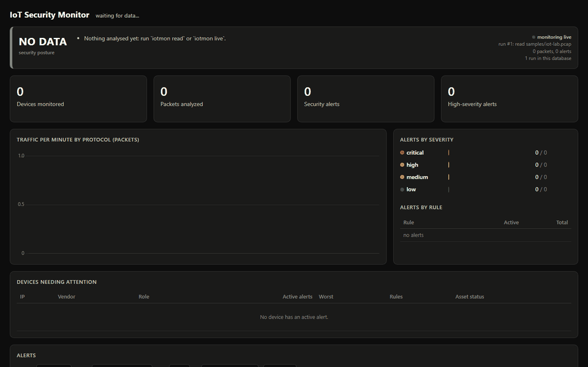

# IoT Security Monitoring System

[](https://github.com/kgiannopoulou/iot-security-monitor/actions/workflows/tests.yml)


A passive network security monitor for IoT and OT networks, written in
Python. It watches traffic on a network segment, builds an inventory of the
devices on it, learns how each device normally behaves, decodes the IoT
protocol itself (MQTT), and raises alerts when something changes: a rogue
device, a port scan, a sensor that suddenly talks to the internet, a
spoofed telemetry value. The alerts are logged to SQLite, triaged by an
analyst, and summarised as one security posture on a web and terminal
dashboard.



*Replay of the bundled capture at 16× speed: five minutes of normal factory
telemetry (posture OK), then a Mirai-style intrusion. A rogue Raspberry Pi
appears (WATCH), scans and brute-forces its way in, and the compromised
camera starts calling a botnet C2 server (CRITICAL).*

**Contents:**
[Problem](#1-the-problem) ·
[Architecture](#2-architecture) ·
[Implementation](#3-implementation) ·
[Detections](#4-detections) ·
[Demonstration](#5-demonstration) ·
[Results](#6-results) ·
[Limitations](#7-limitations) ·
[Future improvements](#8-future-improvements) ·
[What I learned](#9-what-i-learned) ·
[Repository layout](#repository-layout)

---

## 1. The problem

IoT and OT networks are full of devices that can't defend themselves:
sensors, drives, cameras and smart plugs with no endpoint agent, old
firmware, default credentials and plaintext protocols. You can't install
antivirus on a PLC or an ESP32. What you *can* do is watch the network
they share. Three things make that useful:

1. **Asset visibility.** You can't protect what you don't know is there.
   Every OT security standard (IEC 62443, NIST SP 800-82, CISA's asset
   inventory guidance) starts with an inventory, and a new, unexpected
   device is one of the strongest signals there is.
2. **Behaviour is predictable.** A temperature sensor talks to one broker
   on one port every five seconds, for years. That makes "different from
   normal" a far better detector on these networks than on an office LAN.
   It also means fixed rules ("port 23 is bad") miss most attacks.
3. **The protocol matters.** A sensor keeps one MQTT session open for days.
   Spoofed readings, message floods and rogue subscribers never open a new
   connection, so they are invisible at the TCP level. You have to look
   inside the protocol.

This project is a working answer to that problem at lab scale: a passive
monitor (it never sends a packet) that turns raw traffic into an asset
inventory, behaviour-based detections and a security state that someone
can understand in ten seconds.

## 2. Architecture


| Stage | What happens | Code |
|---|---|---|
| **1. Devices** | A Docker lab of simulated IoT devices (MQTT broker, temperature sensor, motor drive, smart plug, IP camera) or a pcap file. The monitor sniffs the lab bridge from the host, the container equivalent of a switch SPAN port. | [`simulator/`](simulator), [`lab/`](lab), [`samples/`](samples) |
| **2. Python monitor** | Captures and decodes each packet down to the MQTT topic or DNS query, groups packets into flows, and tracks devices (MAC, vendor, role, protocols, connections) against a persistent asset register. | [`capture`](src/iotmon/capture.py), [`parser`](src/iotmon/parser.py), [`flows`](src/iotmon/flows.py), [`inventory`](src/iotmon/inventory.py), [`assets`](src/iotmon/assets.py), [`mqtt`](src/iotmon/mqtt.py) |
| **3. Detection engine** | Learns a behavioural baseline per device, then runs nine rules. Each counts something in a time window and compares it with a threshold derived from that device's baseline. | [`detections`](src/iotmon/detections.py), [`baseline`](src/iotmon/baseline.py), [`rules/detection_rules.yaml`](rules/detection_rules.yaml) |
| **4. Logging / alerts** | Every alert is an evidence record in SQLite (with triage status and analyst notes) and in `alerts.jsonl` for a SIEM. Devices, traffic per minute, flows, MQTT state and monitoring runs are logged too. | [`storage`](src/iotmon/storage.py) |
| **5. Security dashboard** | A posture verdict (CRITICAL / AT RISK / WATCH / OK) with its reasons, devices ranked by risk, alerts with triage and export, traffic charts: on the web and in the terminal. | [`state`](src/iotmon/state.py), [`dashboard/`](src/iotmon/dashboard), [`cli`](src/iotmon/cli.py) |

More detail, including the data model: [docs/architecture.md](docs/architecture.md).

## 3. Implementation

**Stack:** Python 3.11+, scapy (capture and dissection), Flask (dashboard
API), SQLite (log), Chart.js (one chart), PyYAML (config), pytest, Docker
Compose (lab), GitHub Actions (CI).

How the pieces fit:

* **One record type from capture to storage.** `capture.py` yields a
  `PacketRecord` (time, MACs, IPs, ports, flags, app protocol, decoded MQTT
  or DNS facts) for both live capture and pcap replay. Everything
  downstream is identical for both, which is why the same scenarios run in
  the tests and in the live lab.
* **Device tracking keyed by MAC, not IP.** IPs change with DHCP; the MAC is
  the device. That is also what makes ARP spoofing visible (DET-008): one
  IP, two MACs. Vendors come from the MAC's OUI, roles from what the device
  serves and how it uses MQTT.
* **A baseline per device, then frozen.** During a learning period (or from
  a trusted capture with `iotmon baseline learn`) the monitor records each
  device's ports, internet peers, peak connection rate and MQTT topics,
  then freezes it, so an attacker can't slowly teach the monitor that
  their traffic is normal.
* **Packet timestamps drive every time window**, never the wall clock. A
  replayed capture produces exactly the same alerts every time, and the
  tests assert the exact list.
* **Rules are data, logic is code.** Rule IDs, names, thresholds, windows
  and ATT&CK mappings live in
  [`rules/detection_rules.yaml`](rules/detection_rules.yaml); site settings
  (networks, learning period) in [`config.yaml`](config.yaml). A test
  replays every capture and fails if an alert's severity or ATT&CK
  technique isn't declared for its rule, so the file can't drift from the
  code.
* **SQLite as the system of record.** The monitor writes, the dashboard
  reads (WAL mode lets both work at once). The only write back is an
  analyst's triage decision. The schema is versioned and upgrades itself.

Every design decision, with the alternatives I rejected and why:
**[docs/design-decisions.md](docs/design-decisions.md)**.

## 4. Detections

```
$ iotmon rules
ID       DETECTOR             ON  SEVERITIES             NAME
DET-001  new_device           yes medium                 New/unrecognized device
DET-002  port_scan            yes medium, high           Port scanning behaviour
DET-003  connection_rate      yes medium                 Abnormal connection rate
DET-004  suspicious_port      yes medium, high, critical Communication with unusual ports
DET-005  external_connection  yes medium, high           Unexpected external connection
DET-006  traffic_spike        yes high                   Traffic volume spike
DET-007  failed_connections   yes medium, high           Repeated failed connections
DET-008  device_change        yes low, high              Device address change
DET-009  mqtt_activity        yes low, medium, high      Abnormal MQTT activity
```

| ID | Fires on | Threshold (why it is anomalous) | ATT&CK |
|---|---|---|---|
| DET-001 | MAC not in the asset register | Unknown hardware on an OT segment is never routine | T1200 / ICS T0848 |
| DET-002 | ≥ 15 ports on one host, one port on ≥ 8 hosts, or ARP for ≥ 12 addresses, in 60 s | IoT devices talk to a handful of fixed peers | T1046, T1018 / ICS T0846 |
| DET-003 | Connections in 60 s ≥ max(20, 5 × the device's learned peak) | Relative to *this* device; a floor stops quiet devices alerting on noise | T1499 / ICS T0814 |
| DET-004 | *Established* session on a port outside the device's baseline, or on Telnet / IRC / ADB… | Established, so a refused probe isn't counted | T1021 / ICS T0886 |
| DET-005 | Internet host not among the device's learned peers; high if the device is local-only or the IP was never resolved by DNS | Malware dials hard-coded IPs; real firmware resolves names | T1071 / ICS T0869 |
| DET-006 | tx/rx per 10 s > max(mean + 4σ, 5 × mean, 50 kB) of its own history | Three conditions, so a quiet device's tiny σ can't trigger it | T1498 / ICS T0814 |
| DET-007 | ≥ 10 refused/unanswered connections to one service, or ≥ 5 MQTT login refusals, in 60 s | Brute force and default-credential attempts | T1110 / ICS T0812 |
| DET-008 | An IP claimed by a second MAC (ARP spoofing), or a known MAC on a new IP | Static OT addressing makes changes meaningful | T1557.002 / ICS T0830 |
| DET-009 | New client on the broker; publishes ≥ max(30, 5 × learned peak); another device's topic (spoofing); `#` subscription | Industrial MQTT clients and topics are a fixed set | ICS T0856, T0855, T0801 |

None of them is "if port == X then hacker". Each rule's logic, threshold
reasoning, false positives and blind spots: [docs/detection-rules.md](docs/detection-rules.md).

## 5. Demonstration

### Quick start (no Docker, no admin rights)

```bash
git clone https://github.com/kgiannopoulou/iot-security-monitor && cd iot-security-monitor
pip install -e ".[dev]"
iotmon read samples/iot-lab.pcap        # packet table + alerts as they fire
iotmon status                           # security posture in the terminal
iotmon dashboard                        # http://127.0.0.1:8080
iotmon read samples/iot-lab.pcap -q --speed 16   # replay in real time and watch the dashboard react
```

(`python -m iotmon ...` works too.)

### Example alerts

The bundled capture ([`samples/iot-lab.pcap`](samples), generated
deterministically by [`tools/generate_sample_pcap.py`](tools/generate_sample_pcap.py))
contains five minutes of normal factory traffic followed by an intrusion:

```
10:35:00  [ALERT MEDIUM]   DET-001 new_device: New IoT device detected: 192.168.1.66 (Raspberry Pi Foundation)
                           IP: 192.168.1.66   MAC: b8:27:eb:00:00:66   Vendor: Raspberry Pi Foundation
10:35:00  [ALERT MEDIUM]   DET-002 port_scan: ARP sweep from 192.168.1.66
10:35:10  [ALERT HIGH]     DET-002 port_scan: Port scan: 192.168.1.66 probed 15 ports on 192.168.1.22
10:35:30  [ALERT HIGH]     DET-004 suspicious_port: TELNET session 192.168.1.66 -> 192.168.1.22:23
10:35:52  [ALERT MEDIUM]   DET-007 failed_connections: Repeated failed connections: 192.168.1.66 -> 192.168.1.21:23 (10x)
10:36:00  [ALERT MEDIUM]   DET-009 mqtt_activity: New MQTT client: 192.168.1.66 connected to broker 192.168.1.10 as 'probe-0'
10:36:06  [ALERT HIGH]     DET-007 failed_connections: MQTT authentication failures: 192.168.1.66 refused 5x by broker 192.168.1.10
10:36:35  [ALERT MEDIUM]   DET-005 external_connection: Unexpected external connection: 192.168.1.22 -> 198.51.100.23:6667 (cnc.badbot.example)
10:36:35  [ALERT CRITICAL] DET-004 suspicious_port: IRC session 192.168.1.22 -> 198.51.100.23:6667
10:36:40  [ALERT HIGH]     DET-005 external_connection: Unexpected external connection: 192.168.1.22 -> 198.51.100.77:53
10:36:40  [ALERT MEDIUM]   DET-003 connection_rate: Abnormal connection rate: 192.168.1.22 opened 20 connections in 60s (baseline peak 4)
10:36:50  [ALERT HIGH]     DET-006 traffic_spike: Traffic spike: 192.168.1.22 sent 591,031 bytes in 10s (baseline 9,027)

3546 packets, 7 devices, 12 alerts
```

Every alert is also an evidence record (`alerts.jsonl`, SQLite, CSV export):

```json
{"timestamp": "2026-10-07T10:35:10.280Z", "rule": "DET-002", "severity": "HIGH", "source_ip": "192.168.1.66",
 "description": "Port scan: 192.168.1.66 probed 15 ports on 192.168.1.22", "ports_observed": 15, "window_s": 60.0,
 "mitre": "T1046 Network Service Discovery / ICS T0846", ...}
```

### The dashboard


The posture banner answers "are we OK?" with reasons. Below it: the four
headline numbers, traffic per protocol, alerts by severity and rule,
devices ranked by their active alerts, and the alert list with filters,
triage buttons (*Ack / Resolve / False +*) and CSV export. The same view in
the terminal:

```
$ iotmon status            # live Docker lab, after the attack scenarios and triage
IOT SECURITY MONITOR                                                                posture: AT RISK
────────────────────────────────────────────────────────────────────────────────────────────────────
Devices monitored                     10   2 not approved
Packets analyzed                   1,786   417.5 kB
Security alerts                       12   6 active
High-severity alerts                   5   3 active

Why AT RISK
  - 3 active high alerts: DET-004 suspicious_port, DET-005 external_connection, DET-009 mqtt_activity
  - 2 devices not approved in the asset register: 172.28.0.66, 172.28.0.1
  - Most affected device: 172.28.0.20 (Espressif (ESP32/ESP8266)), 6 active alerts
  - 6 alerts already triaged as resolved or false positive
```

### Live Docker lab and attack scenarios

```bash
cd lab && docker compose up -d --build     # broker, 4 IoT devices, cloud, DNS, admin, monitor, dashboard
# wait ~2 minutes for data/lab/baseline.json (the monitor learns normal behaviour)
python tools/lab_scenarios.py              # run the controlled attacks, check which rules fired
```

```
SCENARIO                       EXPECTED           FIRED              ALERTS  RESULT
det-001-new-device             DET-001            DET-001                 1  PASS
det-002-port-scan              DET-002            DET-002                 1  PASS
det-003-connection-flood       DET-003            DET-003                 1  PASS
det-004-unusual-port           DET-004            DET-004                 2  PASS
det-005-external-connection    DET-005            DET-005                 1  PASS
det-009-new-mqtt-client        DET-004, DET-009   DET-004, DET-009        3  PASS
det-009-message-burst          DET-009            DET-009                 1  PASS
det-009-topic-spoofing         DET-009            DET-009                 1  PASS

8/8 live scenarios passed
```

The attacks ([`simulator/attacks.py`](simulator/attacks.py)) run from inside
lab containers: a short-lived "rogue" Raspberry Pi, the temperature sensor
playing a compromised device, the admin workstation. There is deliberately
no attacker image and nothing leaves the lab. Lab guide: [docs/lab-setup.md](docs/lab-setup.md).

## 6. Results

| Measure | Result |
|---|---|
| Intrusion in the sample capture | Every stage detected: **12 alerts from 8 of the 9 rules**, from the rogue device's first packet to the C2 traffic (DET-008, ARP spoofing, has its own unit and live tests) |
| False positives on normal traffic | **0 alerts** during the 5-minute baseline of the sample capture (a test) |
| Recorded test scenarios | **10/10** fire exactly their expected rules, including a near miss at 80% of every threshold that must stay silent |
| Live Docker lab | **8/8** scenarios pass, re-run after each week's changes (Weeks 3-6) |
| Throughput | ≈ 4,200 packets/s parsing and ≈ 6,500 packets/s detection on a laptop (Python 3.14, scapy 2.8): ample for an IoT segment, not for a data-centre link |
| Tests | **106 pytest tests** (parsing, every rule positive and negative, scenarios, end to end, storage, posture, dashboard API, rule-file consistency), run in CI on Python 3.11-3.13 |
| False positives found live, and fixed | 3 (see below): each led to a config change, a code fix with a regression test, or a documented, triageable known issue |

The live lab found things the synthetic tests couldn't: the Docker gateway
appearing as a "new device" (fixed in site config), a high-rate motor drive
flagged during learning (fixed in code, regression test added), and a
camera upload spike at lab start (documented on the roadmap, closed as a
false positive through triage). Write-ups with full transcripts: Weeks
[1](docs/01-networking-foundation.md), [2](docs/02-device-inventory.md),
[3](docs/03-detection-engine.md), [4](docs/04-iot-protocols.md),
[5](docs/05-logging-dashboard.md), [6](docs/06-project-presentation.md).

## 7. Limitations

* **Encrypted traffic.** With MQTT over TLS (port 8883) topics and payloads
  are hidden. The monitor still sees who connects, how often and how much,
  but DET-009's protocol checks would need the broker's logs instead.
* **Baseline quality.** The behavioural rules are only as good as the
  learning period. A device that is already compromised while the monitor
  learns will be learned as normal. Learning from a reviewed capture
  (`iotmon baseline learn`) is the mitigation.
* **Thresholds are tuned for a lab.** Slow scans below 15 ports per minute,
  low-and-slow exfiltration and attacks that mimic normal peers are not
  caught. Each rule's blind spots are written down in [detection-rules.md](docs/detection-rules.md).
* **Scale.** Python and scapy handle thousands of packets per second, which
  suits one IoT segment. A production sensor would parse with Zeek or
  Suricata and keep this detection layer on top.
* **Single node, no users.** One SQLite file and a dashboard without a
  login: fine on 127.0.0.1 in a lab, not for a shared deployment.
* **Simulated devices.** No real PLCs, cameras or sensors were tested; the
  lab devices are Python scripts with realistic MACs and traffic.

## 8. Future improvements

1. **Modbus/TCP and DNP3 visibility**, linking this project to my
   [OT/ICS lab](https://github.com/kgiannopoulou/ot-ics-cybersecurity-lab):
   who reads and writes which registers, with which function codes.
2. **SIEM integration:** ship `alerts.jsonl` to Wazuh or Elastic and export
   the rules in Sigma format.
3. **Incident grouping:** six alerts about one compromised sensor are one
   incident, so group them by device and time window.
4. **Feedback from triage:** let a false-positive decision suggest an
   allowlist entry or a threshold change.
5. **Dashboard login and an audit trail** (who changed which alert, when),
   giving time-to-acknowledge and time-to-resolve metrics.
6. **TLS fingerprints (JA3/SNI)** for visibility into encrypted traffic, and
   ingesting broker logs.
7. **Real hardware:** a Raspberry Pi on a switch's SPAN port in front of
   real IoT devices.

Full list: [docs/roadmap.md](docs/roadmap.md).

## 9. What I learned

The short version (the full write-up, with the incidents behind each
point, is in **[docs/lessons-learned.md](docs/lessons-learned.md)**):

* **Packets are not the unit of analysis.** Flows, devices and sessions
  are. Most of the work is turning packets into those.
* **Thresholds need a reason.** "Five times this device's own busiest
  minute, and never below 20" is a rule I can defend in a review. "More
  than 50" isn't.
* **A detector you haven't seen fail is a detector you don't understand.**
  The near-miss scenario and the live lab caught problems that a positive
  test suite never would.
* **False positives are design input, not noise.** All three live false
  positives changed the design: site config for infrastructure, a
  different learning rule for telemetry, and a triage workflow.
* **IoT security is protocol security.** The most dangerous scenario,
  spoofed telemetry, is invisible to every network-level rule.
* **A security tool is finished when someone else can read its output.**
  A posture with reasons, and triage with notes, mattered more than a ninth
  rule.

Interview-style questions and answers on every design choice:
[docs/design-decisions.md](docs/design-decisions.md).

---

## Repository layout

```
iot-security-monitor/
├── README.md
├── config.yaml                  site settings: monitored networks, learning period, flows
├── rules/
│   └── detection_rules.yaml     rule catalogue: IDs, thresholds, severities, ATT&CK
├── src/iotmon/                  the monitor (pip install -e .)
│   ├── capture.py, parser.py    packet capture and protocol decoding  (the "monitor")
│   ├── inventory.py, assets.py  device tracking and the asset register ("device tracker")
│   ├── baseline.py, mqtt.py     per-device behaviour, MQTT clients and topics
│   ├── detections.py            the nine detectors                      ("detector")
│   ├── models.py, state.py      alert records, posture and device risk  ("alerts")
│   ├── storage.py               SQLite schema, triage, retention        ("database")
│   ├── dashboard/               Flask API + web page
│   ├── pipeline.py              wires the stages together
│   └── cli.py                   iotmon read / live / status / alerts / rules / ...
├── simulator/                   simulated IoT devices and the controlled attacks (Docker image)
├── lab/                         Docker Compose lab: broker, DNS, devices, monitor, dashboard
├── samples/                     sample intrusion capture + one capture per test scenario
├── tools/                       capture generators, scenario runners, demo recorder
├── tests/                       106 pytest tests
├── screenshots/                 architecture diagram, dashboard screenshots, demo GIF
└── docs/                        weekly write-ups, architecture, rules, design decisions, lessons learned
```

The layout follows a standard Python *src layout*: the package lives under
`src/iotmon/`, so the tests always run against the installed package and
never by accident against the working directory. Modules are named after
what they do (`detections`, `storage`), and the brief's names
(`detector`, `database`, ...) are noted above.

## CLI reference

| Command | Purpose |
|---|---|
| `iotmon read FILE.pcap` | Analyse a capture. `-q` alerts only, `--speed X` replay in real time, `--csv` write every packet, `--utc` |
| `iotmon live -i IFACE` | Capture live (root / `CAP_NET_RAW`; Npcap on Windows). `-f 'bpf filter'`, `-t SECONDS` |
| `iotmon status` | Security posture, headline numbers, devices needing attention, recent alerts (`-w 5` to refresh, `--json`) |
| `iotmon alerts` | Query alerts: `--severity`, `--status` (or `active`), `--rule`, `--ip`, `--since 6h`, `--json` |
| `iotmon alerts ack` / `resolve` / `fp` / `reopen ID...` | Triage alerts, `--note` for the analyst's reason |
| `iotmon alerts export` | Filtered alerts with status, note and evidence as CSV or JSON |
| `iotmon rules [-v]` | The rule catalogue, with thresholds and ATT&CK techniques |
| `iotmon inventory learn / show / approve` | Build and review the asset register |
| `iotmon baseline learn / show` | Learn and inspect each device's normal behaviour |
| `iotmon mqtt` | MQTT clients and topics |
| `iotmon report` | Devices, top flows, alerts |
| `iotmon db info` / `db prune --keep-days N` | Schema, row counts, monitoring runs / retention |
| `iotmon dashboard` | Web dashboard on `127.0.0.1:8080` (`--read-only` disables triage) |

Common options: `--config site.yaml` (override any setting, see
[`lab/monitor.yaml`](lab/monitor.yaml)), `--rules FILE`, `--db PATH`,
`--append`, `--no-store`, `--inventory [JSON]`, `--baseline [JSON]`.

## Tests

```bash
pip install -e ".[dev]"
python -m pytest
```

106 tests: parsing of every supported protocol, positive and negative cases
for each rule, each controlled scenario triggering exactly its rules (and
the near miss none), the full intrusion producing exactly the expected 12
alerts, zero alerts during the baseline, the MQTT tracker, the asset
register workflow, storage and schema upgrades, every posture level, the
dashboard API including its cross-site checks, and the rule file against
the alerts the engine produces. CI runs them on every push.

## Documentation

| Week | Write-up |
|---|---|
| 1 | [Networking foundation: what the monitor sees and why](docs/01-networking-foundation.md) |
| 2 | [Device discovery and asset inventory](docs/02-device-inventory.md) |
| 3 | [Detection engine and test scenarios](docs/03-detection-engine.md) |
| 4 | [IoT protocols (MQTT)](docs/04-iot-protocols.md) |
| 5 | [Logging and security dashboard](docs/05-logging-dashboard.md) |
| 6 | [Turning it into a presentable project](docs/06-project-presentation.md) |
| | [Architecture](docs/architecture.md) · [Detection rules](docs/detection-rules.md) · [Design decisions](docs/design-decisions.md) · [Lessons learned](docs/lessons-learned.md) · [Lab setup](docs/lab-setup.md) · [Roadmap](docs/roadmap.md) |

## Scope

Built to monitor my own lab network and simulated devices. The sample
capture is synthetic and uses only private (RFC 1918) and documentation
(RFC 5737) address ranges. No traffic leaves the lab.

Related projects: [OT/ICS Cybersecurity Lab](https://github.com/kgiannopoulou/ot-ics-cybersecurity-lab) ·
[Smart Factory Threat Assessment](https://github.com/kgiannopoulou/smart-factory-threat-assessment)

## License

MIT
