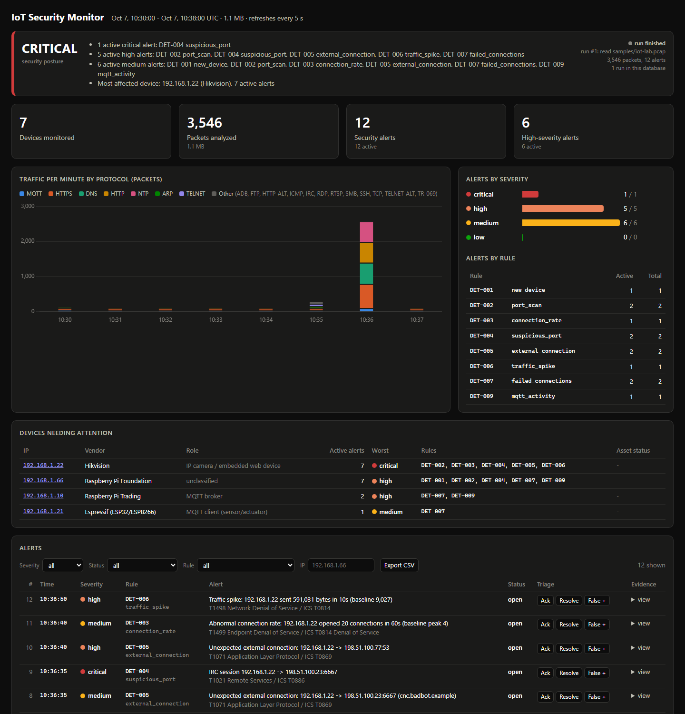
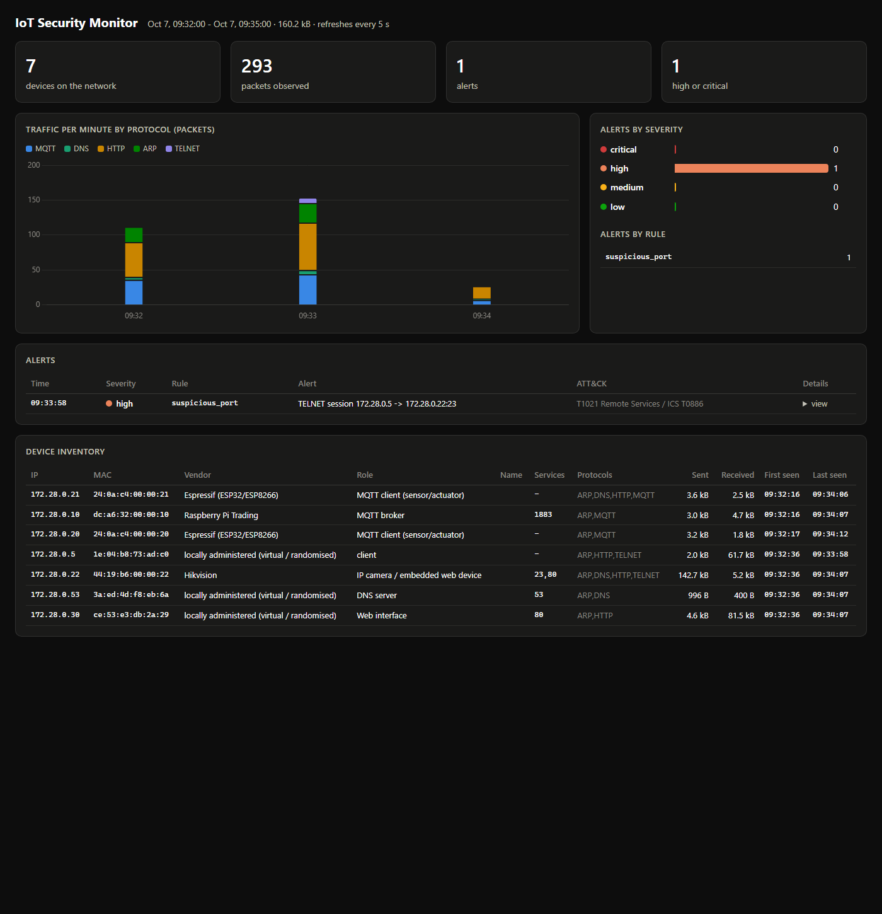

# IoT Security Monitoring System

A passive network monitor for IoT / OT networks, written in Python. It captures
traffic (live or from a pcap), decodes it down to the MQTT topic and DNS
query, builds a persistent device inventory, learns how each device normally
behaves, runs eight detection rules (DET-001 to DET-008), stores the results
in SQLite / JSONL / CSV, and shows them on a web dashboard.

It comes with a Docker lab of simulated IoT devices to monitor, a
deterministic sample capture of a Mirai-style intrusion, and one controlled
test scenario per rule, replayed in the tests and run live against the lab.



```
IoT / OT devices ──▶ Python monitor ──▶ Detection engine ──▶ Logging / alerts ──▶ Dashboard
 (Docker lab or       capture, parse,     DET-001..008 vs a     SQLite, JSONL,       devices, alerts,
  pcap file)          flows, inventory    learned per-device    CSV                  traffic, severity
                                          baseline
```

## What it demonstrates

| Skill | Where |
|---|---|
| **Python development** | Clean package with a CLI, typed dataclasses, 67 pytest tests, a Flask API ([`iotmon/`](iotmon)) |
| **Networking** | Layer-by-layer parsing (Ethernet → ARP/IP → TCP/UDP → MQTT/DNS/HTTP), flows vs packets, SPAN-style capture. Explained in **[Week 1: what the monitor sees and why](docs/01-networking-foundation.md)** |
| **Detection engineering** | Eight stateful rules with IDs, sliding windows and thresholds learned from each device's own behaviour, evidence-record alerts, ATT&CK mapping, documented false positives and blind spots, controlled test scenarios including a near miss that must stay silent (**[Week 3: detection engine](docs/03-detection-engine.md)**, [rules](docs/detection-rules.md)) |
| **IoT / OT security** | Passive asset inventory with an approve workflow ([Week 2](docs/02-device-inventory.md)), rogue-device and ARP-spoofing detection, MQTT authentication monitoring, exposed Telnet, botnet C2 and flood behaviour, OUI vendor fingerprinting |

## Quick start (no Docker, no admin rights)

```bash
pip install -r requirements.txt
python -m iotmon read samples/iot-lab.pcap        # packet table + alerts
python -m iotmon report                           # devices, top flows, alerts
python -m iotmon dashboard                        # http://127.0.0.1:8080
```

Output (abridged, `--utc`):

```
TIME      SOURCE           DESTINATION      PROTOCOL  PORT  APP       INFO
10:30:02  192.168.1.20     192.168.1.10     TCP       1883  MQTT      CONNECT id=temp-sensor-01 user=devices
10:30:02  192.168.1.10     192.168.1.20     TCP       1883  MQTT      CONNACK accepted
10:30:05  192.168.1.20     192.168.1.10     TCP       1883  MQTT      PUBLISH factory/line1/temp
10:30:15  192.168.1.21     192.168.1.1      UDP         53  DNS       query api.smartplug.example
10:30:15  192.168.1.1      192.168.1.21     UDP         53  DNS       answer api.smartplug.example -> 203.0.113.50
10:30:15  192.168.1.21     203.0.113.50     TCP        443  HTTPS     TLS record, 606 bytes (encrypted)
...
10:35:00  [ALERT MEDIUM]   DET-001 new_device: New IoT device detected: 192.168.1.66 (Raspberry Pi Foundation)
                           IP: 192.168.1.66   MAC: b8:27:eb:00:00:66   Vendor: Raspberry Pi Foundation
10:35:00  [ALERT MEDIUM]   DET-002 port_scan: ARP sweep from 192.168.1.66
10:35:10  [ALERT HIGH]     DET-002 port_scan: Port scan: 192.168.1.66 probed 15 ports on 192.168.1.22
10:35:30  [ALERT HIGH]     DET-004 suspicious_port: TELNET session 192.168.1.66 -> 192.168.1.22:23
10:35:52  [ALERT MEDIUM]   DET-007 failed_connections: Repeated failed connections: 192.168.1.66 -> 192.168.1.21:23 (10x)
10:36:06  [ALERT HIGH]     DET-007 failed_connections: MQTT authentication failures: 192.168.1.66 refused 5x by broker 192.168.1.10
10:36:35  [ALERT MEDIUM]   DET-005 external_connection: Unexpected external connection: 192.168.1.22 -> 198.51.100.23:6667 (cnc.badbot.example)
10:36:35  [ALERT CRITICAL] DET-004 suspicious_port: IRC session 192.168.1.22 -> 198.51.100.23:6667
10:36:40  [ALERT HIGH]     DET-005 external_connection: Unexpected external connection: 192.168.1.22 -> 198.51.100.77:53
10:36:40  [ALERT MEDIUM]   DET-003 connection_rate: Abnormal connection rate: 192.168.1.22 opened 20 connections in 60s (baseline peak 4)
10:36:50  [ALERT HIGH]     DET-006 traffic_spike: Traffic spike: 192.168.1.22 sent 591,031 bytes in 10s (baseline 9,027)

3546 packets, 7 devices, 11 alerts
```

Full outputs are in [`docs/sample-output/`](docs/sample-output).

## Device inventory and asset register (Week 2)

The monitor keeps an inventory of every device it sees, keyed by MAC: IPs,
vendor, role, first/last seen, protocols, and connection count. With
`--inventory` it is saved to `data/inventory.json` between runs, so "new
device" means new to this network, not just new since the monitor started.

```bash
python -m iotmon inventory learn samples/iot-lab.pcap --duration 290   # baseline from trusted traffic
python -m iotmon read samples/iot-lab.pcap -q --inventory              # rogue Pi alerts, saved as pending
python -m iotmon inventory show                                        # review the register
python -m iotmon inventory approve b8:27:eb:00:00:66                   # or --all
```

```
IP              MAC               VENDOR                     ROLE                             PROTOCOLS                 CONN  ...  STATUS
192.168.1.20    24:0a:c4:00:00:20 Espressif (ESP32/ESP8266)  MQTT client (sensor/actuator)    ARP,MQTT,NTP                 2  ...  approved
192.168.1.22    44:19:b6:00:00:22 Hikvision                  IP camera / embedded web device  ARP,DNS,HTTP,HTTPS,IRC,N  2465  ...  approved
192.168.1.66    b8:27:eb:00:00:66 Raspberry Pi Foundation    unclassified                     ARP,MQTT,TELNET             64  ...  pending
```

A known MAC on a new IP raises a low `device_change` event. A second MAC
claiming an IP that is already in use, which is what ARP spoofing looks like,
raises a high one. Both were validated live in the Docker lab. Details:
**[Week 2: device discovery and inventory](docs/02-device-inventory.md)**.

## Detection engine (Week 3)

Eight rules, each with an ID. None of them is "if port == X then hacker":
each counts something inside a time window and compares it with a
threshold, and the core rules take that threshold from the device's own
**behavioural baseline** (the ports it uses and serves, its internet peers,
its peak connection rate), learned during a learning period or from a
trusted capture.

```bash
python -m iotmon baseline learn samples/iot-lab.pcap -d 300   # learn normal behaviour per device
python -m iotmon baseline show
python tools/run_scenarios.py                                 # controlled test scenarios
```

```
SCENARIO                       EXPECTED             FIRED                ALERTS  RESULT
det-001-new-device             DET-001              DET-001                   1  PASS
det-002-port-scan              DET-002              DET-002                   1  PASS
det-003-connection-flood       DET-003              DET-003                   1  PASS
det-004-unusual-port           DET-004              DET-004                   2  PASS
det-005-external-connection    DET-005              DET-005                   2  PASS
near-miss-below-thresholds     none                 none                      0  PASS
iot-lab (full kill chain)      DET-001..007         DET-001..007             11  PASS
```

Every alert is an evidence record in `alerts.jsonl`:

```json
{"timestamp": "2026-10-07T10:35:10.280Z", "rule": "DET-002", "severity": "HIGH", "source_ip": "192.168.1.66",
 "description": "Port scan: 192.168.1.66 probed 15 ports on 192.168.1.22", "ports_observed": 15, "window_s": 60.0, ...}
```

The same scenarios run live against the Docker lab with
`python tools/lab_scenarios.py`. Details, threshold reasoning and results:
**[Week 3: detection engine](docs/03-detection-engine.md)**.

## Live lab (Docker)

```bash
cd lab
docker compose up -d --build          # broker, 3 IoT devices, cloud, DNS, admin, monitor, dashboard
# http://localhost:8080
```

The monitor sniffs the lab's bridge (`iotlab0`) from the host network
namespace, the container equivalent of a switch SPAN port. Details and a
live detection check are in the [lab guide](docs/lab-setup.md).



## CLI

| Command | Purpose |
|---|---|
| `iotmon read FILE.pcap` | Analyse a capture. `-q` alerts only, `--csv` also write every packet, `--utc`, `-c N` |
| `iotmon live -i IFACE` | Capture live (root / `CAP_NET_RAW`; Npcap on Windows). `-f 'bpf filter'`, `-t SECONDS` |
| `iotmon report` | Devices, top flows, and alerts from the database |
| `iotmon inventory learn FILE.pcap` | Build the asset register from trusted traffic (`-d SECONDS` to use only the start) |
| `iotmon inventory show` / `approve MAC_OR_IP` | Review the register (`--json` keyed by IP); approve pending devices (`--all`) |
| `iotmon baseline learn FILE.pcap` | Learn each device's normal behaviour from trusted traffic (`-d SECONDS`, `--force` to replace) |
| `iotmon baseline show` | Ports each device uses and serves, its internet peers and peak connection rate (`--json`) |
| `iotmon dashboard` | Web dashboard on `127.0.0.1:8080` |

Common options: `--config my.toml` (override any threshold in
[`default.toml`](iotmon/default.toml)), `--db PATH`, `--append`, `--no-store`, `--inventory [JSON]` (use and update the asset register), `--baseline [JSON]` (compare with a saved behavioural baseline, or learn and save one).

Outputs (default `data/`): `iotmon.db` (SQLite: alerts, devices, flows,
per-minute traffic), `alerts.jsonl` (SIEM-ready), `packets.csv` (with `--csv`),
`inventory.json` (asset register, with `--inventory`), `baseline.json` (behavioural baseline, with `--baseline`).

## Detection rules

| ID | Rule | Fires on | ATT&CK |
|---|---|---|---|
| DET-001 | `new_device` | MAC not in the asset register (or, without one, first seen after the 60 s learning period) | T1200 / ICS T0848 |
| DET-002 | `port_scan` | ≥ 15 ports on one host, one port on ≥ 8 hosts, or ARP for ≥ 12 addresses, within 60 s | T1046, T1018 / ICS T0846 |
| DET-003 | `connection_rate` | Connection attempts in 60 s ≥ max(20, 5 × the device's learned peak) | T1499 / ICS T0814 |
| DET-004 | `suspicious_port` | *Established* session on a port outside the device's baseline, or on Telnet, IRC, ADB, TR-069…; plaintext MQTT to the internet | T1021 / ICS T0886 |
| DET-005 | `external_connection` | Internet host not among the device's learned peers; high if the device is local-only, the IP was never resolved by DNS, or ≥ 10 hosts in 300 s | T1071 / ICS T0869 |
| DET-006 | `traffic_spike` | Device tx/rx per 10 s > max(mean + 4σ, 5×mean, 50 kB) of its own history | T1498 / ICS T0814 |
| DET-007 | `failed_connections` | ≥ 10 refused/unanswered connections to one service, or ≥ 5 MQTT login refusals, in 60 s | T1110 / ICS T0812 |
| DET-008 | `device_change` | An IP claimed by a second MAC (ARP spoofing), or a known MAC on a new IP | T1557.002 / ICS T0830 |

Logic, threshold reasoning, false positives, and known gaps: [docs/detection-rules.md](docs/detection-rules.md).

## Project layout

```
iotmon/               the monitor (capture, parser, flows, inventory, assets, baseline, detections, storage, dashboard, cli)
lab/                  Docker lab: Mosquitto broker, dnsmasq, simulated devices, monitor + dashboard;
                      scenarios/attacks.py holds the controlled attack actions for the live tests
samples/iot-lab.pcap  8-minute synthetic capture: 5 min baseline, then the intrusion
samples/scenarios/    one 4-minute capture per test scenario (DET-001..005 and a near miss)
tools/                generate_sample_pcap.py, generate_scenarios.py (deterministic: same bytes every run),
                      run_scenarios.py (replay and check), lab_scenarios.py (run live in the Docker lab)
tests/                parser, per-rule, scenario, end-to-end and dashboard tests
docs/                 Week 1-3 write-ups, architecture, rules, lab guide, roadmap
```

## Tests

```bash
pip install -r requirements-dev.txt
python -m pytest
```

These cover parsing of every supported protocol, positive and negative cases
for each rule, each controlled scenario triggering exactly its rules (and the
near miss triggering none), the full intrusion timeline producing exactly the
expected 11 alerts, **zero alerts during the 5-minute baseline**, storage outputs, the
dashboard API, and the Week 2 inventory: record fields, the asset register
(round trip, bootstrap, replay-safe counters), IP-conflict and IP-change
events, and the full learn → detect → approve workflow.

## Documentation

1. [Week 1: Networking foundation and what the monitor sees](docs/01-networking-foundation.md)
2. [Week 2: Device discovery and asset inventory](docs/02-device-inventory.md)
3. [Week 3: Detection engine and test scenarios](docs/03-detection-engine.md)
4. [Architecture](docs/architecture.md)
5. [Detection rules](docs/detection-rules.md)
6. [Lab setup](docs/lab-setup.md)
7. [Roadmap](docs/roadmap.md)

## Scope

Built for monitoring my own lab network and simulated devices. The sample
capture is synthetic and uses only private (RFC 1918) and documentation
(RFC 5737) address ranges.

Related projects: [OT/ICS Cybersecurity Lab](https://github.com/kgiannopoulou/ot-ics-cybersecurity-lab) ·
[Smart Factory Threat Assessment](https://github.com/kgiannopoulou/smart-factory-threat-assessment)

## License

MIT
