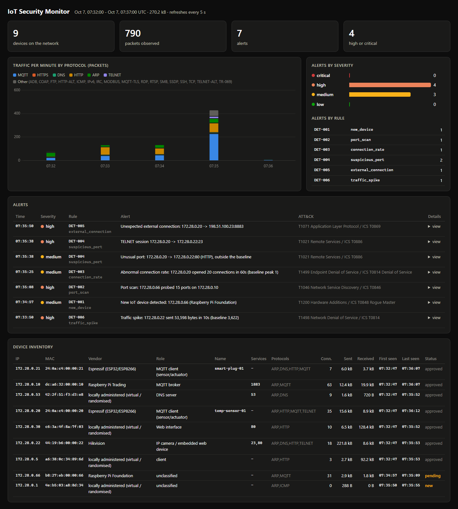

# Week 3: Detection Engine

**Milestone:** generate a few controlled test scenarios in the lab and
demonstrate that the corresponding rules trigger.

Weeks 1 and 2 made the monitor see traffic and know which devices exist.
Week 3 makes it decide what is *wrong*. The goal was not a packet sniffer
with a list of bad ports, but a small detection engine where every alert
can be explained: what was counted, over which window, against which
threshold, and why that threshold is where it is.

Every example below is real `iotmon` output. Full transcripts:
[`week3-detections.txt`](sample-output/week3-detections.txt) (sample capture
and scenarios) and [`live-lab-week3.txt`](sample-output/live-lab-week3.txt)
(Docker lab).

---

## 1. The rule set

| ID | Rule | Question it answers | Counted over | Threshold |
|---|---|---|---|---|
| **DET-001** | New/unrecognized device | Is this device in the asset register? | first packet of a MAC | not in register / after 60 s learning |
| **DET-002** | Port scanning behaviour | Is one source probing many ports or hosts? | 60 s sliding window per source | 15 ports on one host, 8 hosts on one port, 12 ARP targets |
| **DET-003** | Abnormal connection rate | Is a device opening far more connections than it normally does? | 60 s sliding window per source | max(20, 5 × its learned peak) |
| **DET-004** | Communication with unusual ports | Is an established session on a port this device never uses or serves? | every completed handshake / UDP reply | outside learned profile, or high-risk service |
| **DET-005** | Unexpected external connection | Is a device talking to an internet host it never talked to before? | per connection, DNS answers over 10 min, fan-out over 300 s | not a learned peer; severity from DNS and history |
| DET-006 | Traffic volume spike | Is a device sending/receiving far more bytes than usual? | 10 s buckets vs its last 30 | max(mean + 4σ, 5 × mean, 50 kB) |
| DET-007 | Repeated failed connections | Is someone retrying one service and failing? | 60 s per (client, server, port) | 10 failures, 5 MQTT auth refusals |
| DET-008 | Device address change | Did a MAC/IP binding change (ARP spoofing)? | per binding | any conflict |

DET-001 to DET-005 are the five rules the brief asked for. DET-006 to DET-008
existed already or came from Week 2 and now carry IDs too. Rule logic, false
positives and limits are in [detection-rules.md](detection-rules.md).

## 2. From "port == X" to "unusual for this device"

The easy version of an IoT detection is a list: Telnet is bad, IRC is bad,
anything to the internet is bad. That fails both ways. It misses the sensor
that opens the camera's *web UI* (HTTP is on no bad list), and it alerts on
the smart plug's daily call to its vendor cloud.

So the three new rules compare a device with **itself**. During a learning
period the monitor builds a profile per device
([`iotmon/baseline.py`](../iotmon/baseline.py)), then freezes it:

```
$ python -m iotmon baseline learn samples/iot-lab.pcap -d 300
learned 6 device profiles from 590 packets -> data/baseline.json

$ python -m iotmon baseline show
IP              USES PORTS               SERVES PORTS     PEAK CONN  INTERNET PEERS
192.168.1.1     -                        53,123                   0  none (local only)
192.168.1.5     80,123                   -                        2  none (local only)
192.168.1.10    -                        1883                     0  none (local only)
192.168.1.20    123,1883                 -                        2  none (local only)
192.168.1.21    53,123,443,1883          -                        4  203.0.113.50
192.168.1.22    53,123,443               80                       4  203.0.113.80
```

This table is the network's normal state in four columns. The temperature
sensor (`.20`) speaks NTP and MQTT and nothing else, and never leaves the
site. The plug and the camera each talk to exactly one cloud host. On an
IT network a profile like this would be useless; on an IoT/OT network it is
stable for months, which is why it makes a good detector.

Why freeze it: if the baseline kept learning, an attacker who stayed active
long enough would become normal. A frozen profile is re-learned on purpose,
from traffic someone has checked (`iotmon baseline learn`), the same way the
asset register is approved in Week 2.

## 3. Thresholds and time windows: why activity becomes anomalous

Each rule answers "how much, how fast, compared with what?":

**DET-002: a scan is breadth, not volume.** Fifteen *distinct* ports on one
host inside 60 s. The busiest device in the baseline touches four service
ports in total. Connecting to the same port 100 times is not a scan (it is
DET-003's question), and 15 ports over an hour is not caught: slow scans are
a documented gap.

**DET-003: rate relative to the device's own peak.** The sensor's learned
peak is 2 connection attempts per minute, the camera's 4. The threshold is
`max(20, 5 × peak)`:

* the **floor** (20) exists because 5 × 2 = 10 reconnects in a minute happens
  when Wi-Fi drops and comes back. That is a nuisance, not an incident;
* the **factor** keeps busy devices from alerting just for being busy: a
  gateway with a peak of 30 needs 150.

It also defers to DET-002. A scan is also a burst of connections, but it has
already been reported as a scan.

**DET-004: established, not attempted.** The rule looks at completed
handshakes (the client's ACK after the SYN-ACK) and UDP replies. A SYN to a
closed port is reconnaissance (DET-002/007). A session on a port that is not
in the device's profile means communication actually happened. The
high-risk port list (Telnet, IRC, ADB, …) now only decides *severity*: an
established Telnet session is high whether or not the baseline saw it.

**DET-005: several weak signals, one severity.**

| Signal | Why it matters |
|---|---|
| destination not in the device's learned peers | the base condition |
| the device was local-only in the baseline | a sensor has no reason to reach the internet at all → high |
| no DNS answer gave the device this IP in the last 10 min | legitimate cloud clients look names up; malware often uses hard-coded IPs → high |
| ≥ 10 unexpected hosts in 300 s | spreading or scanning the internet → one fan-out alert, not hundreds |

Every alert carries the numbers it was decided on, so the reasoning can be
checked afterwards.

## 4. Evidence records

Alerts are written to `alerts.jsonl` in the shape the brief asked for, with
the rule's own evidence fields appended:

```json
{"timestamp": "2026-10-07T10:35:10.280Z", "rule": "DET-002", "rule_name": "port_scan", "severity": "HIGH",
 "source_ip": "192.168.1.66", "destination_ip": "192.168.1.22",
 "description": "Port scan: 192.168.1.66 probed 15 ports on 192.168.1.22",
 "mitre": "T1046 Network Service Discovery / ICS T0846",
 "ports_observed": 15, "sample_ports": [21, 22, 23, 25, 53, 80, 81, 110, 111, 135, 139, 143, 443, 445, 554],
 "window_s": 60.0, "threshold": 15}
```

```json
{"timestamp": "2026-10-07T10:36:40.000Z", "rule": "DET-005", "rule_name": "external_connection", "severity": "HIGH",
 "source_ip": "192.168.1.22", "destination_ip": "198.51.100.77",
 "description": "Unexpected external connection: 192.168.1.22 -> 198.51.100.77:53", ...,
 "reasons": ["destination is not one of the device's usual external peers",
             "no DNS lookup for this address (direct-to-IP connection)"],
 "usual_external_peers": ["203.0.113.80"], "unexpected_destinations_in_window": 2, "window_s": 300.0}
```

All eleven records from the sample capture are in
[`sample-pcap-alerts.jsonl`](sample-output/sample-pcap-alerts.jsonl). SQLite
stores the rule ID too, and the dashboard shows it next to every alert.

## 5. Controlled test scenarios

Each scenario is a deterministic 4-minute capture
([`tools/generate_scenarios.py`](../tools/generate_scenarios.py)): the same
small network as the sample, two minutes of learning, normal traffic
throughout, and **one** misbehaviour injected at t = 180 s. A scenario passes
only if exactly its rules fire. Silence from every other rule matters as much
as the hit.

| Scenario | What happens | Must fire |
|---|---|---|
| `det-001-new-device` | Unknown Raspberry Pi joins (ARP, NTP, DNS) | DET-001 |
| `det-002-port-scan` | Admin laptop SYN-scans 30 ports on the broker in 1.5 s | DET-002 |
| `det-003-connection-flood` | Sensor opens 30 valid MQTT sessions to its own broker in 30 s | DET-003 |
| `det-004-unusual-port` | Sensor opens the camera's web UI (unusual), then Telnet (high-risk) | DET-004 |
| `det-005-external-connection` | Local-only sensor dials an internet IP; plug calls an unknown host | DET-005 |
| `near-miss-below-thresholds` | 12-port probe, 12 reconnects/min, an extra cloud check-in | **nothing** |

```
$ python tools/run_scenarios.py
SCENARIO                       EXPECTED             FIRED                ALERTS  RESULT
det-001-new-device             DET-001              DET-001                   1  PASS
det-002-port-scan              DET-002              DET-002                   1  PASS
det-003-connection-flood       DET-003              DET-003                   1  PASS
det-004-unusual-port           DET-004              DET-004                   2  PASS
det-005-external-connection    DET-005              DET-005                   2  PASS
near-miss-below-thresholds     none                 none                      0  PASS
iot-lab (full kill chain)      DET-001..007         DET-001..007             11  PASS

== det-003-connection-flood: Sensor opens 30 MQTT sessions to its own broker in 30 s (reconnect storm)
   10:33:19  DET-003  MEDIUM   Abnormal connection rate: 192.168.1.20 opened 20 connections in 60s (baseline peak 2)

== det-004-unusual-port: Sensor opens HTTP (unusual for it) and Telnet (high-risk) sessions to the camera
   10:33:00  DET-004  MEDIUM   Unusual port: 192.168.1.20 -> 192.168.1.22:80 (HTTP), outside the baseline
   10:33:05  DET-004  HIGH     TELNET session 192.168.1.20 -> 192.168.1.22:23

== det-005-external-connection: Local-only sensor dials 198.51.100.23 by IP; plug calls an unknown host
   10:33:00  DET-005  HIGH     Unexpected external connection: 192.168.1.20 -> 198.51.100.23:8883
   10:33:10  DET-005  MEDIUM   Unexpected external connection: 192.168.1.21 -> 203.0.113.99:443 (fw.unknown-cdn.example)
```

Two scenarios are worth a closer look:

* **The connection flood is invisible to every other rule.** Same peer, same
  port, valid credentials, about 11 kB per 10 s. There is no scan, no
  failure and no volume spike. Only the comparison with the sensor's own
  rate catches it.
* **The near miss.** The same kinds of activity at 80% of each threshold
  must stay silent. It is the test for false positives that a positive-only
  test suite would never run.

The same scenarios run as tests (`tests/test_scenarios.py`), and a test
checks that the committed pcaps match the generator byte for byte.

## 6. The scenarios live in the Docker lab

Synthetic captures prove the logic; the lab proves it on real TCP stacks.
[`tools/lab_scenarios.py`](../tools/lab_scenarios.py) runs the attack actions in
[`lab/scenarios/attacks.py`](../lab/scenarios/attacks.py) (standard library
only), either in a short-lived "rogue" container with a Raspberry Pi MAC or
inside the real temperature-sensor container as a compromised device, and
reads the result from the dashboard API.

Everything stays in the lab. The one "internet" connection (DET-005) is sent
with IP TTL 1, so the lab gateway discards it after the monitor has seen the
SYN.

The baseline the monitor learned in the lab's first two minutes:

```
172.28.0.20 {'client_ports': [1883], 'server_ports': [], 'external_peers': [], 'peak_connections': 1}
172.28.0.22 {'client_ports': [53, 80], 'server_ports': [80], 'external_peers': [], 'peak_connections': 4}
...
```

**Run 1 found a real gap.** Four of five scenarios passed. DET-005 fired as
expected, but DET-001 also fired:

```
07:31:53  DET-001  MEDIUM   New IoT device detected: 172.28.0.1 (locally administered (virtual / randomised))
07:31:53  DET-005  HIGH     Unexpected external connection: 172.28.0.20 -> 198.51.100.23:8883
```

`172.28.0.1` is the Docker bridge gateway. It sends nothing in normal
operation, so it was never seen during the learning period and was missing
from the asset register. It spoke for the first time when it returned the
ICMP error for the TTL-1 packet. The monitor was right: a device it had never
seen started talking. The fix is site configuration, not code. Infrastructure
that only speaks when something goes wrong (gateways, a backup router) is
easy to miss when an inventory is built only from observed traffic, so it
belongs in the known-devices list. The lab now passes
[`lab/monitor.toml`](../lab/monitor.toml) to the monitor.

**Run 2, clean lab:**

```
SCENARIO                       EXPECTED           FIRED              ALERTS  RESULT
det-001-new-device             DET-001            DET-001                 1  PASS
det-002-port-scan              DET-002            DET-002                 1  PASS
det-003-connection-flood       DET-003            DET-003                 1  PASS
det-004-unusual-port           DET-004            DET-004                 2  PASS
det-005-external-connection    DET-005            DET-005                 1  PASS

5/5 live scenarios passed
```

The only other alert in the run was the known DET-006 start-up false
positive on the camera (in the first minutes, its 20 kB upload and the
admin's 30 kB snapshot can share one 10 s bucket while the history is still
short). It is listed on the [roadmap](roadmap.md).



## 7. The full kill chain, rule by rule

Replaying the 8-minute sample capture, every stage of the intrusion now maps
to a rule ID:

```
10:35:00  DET-001  MEDIUM    New IoT device detected: 192.168.1.66 (Raspberry Pi Foundation)
10:35:00  DET-002  MEDIUM    ARP sweep from 192.168.1.66
10:35:10  DET-002  HIGH      Port scan: 192.168.1.66 probed 15 ports on 192.168.1.22
10:35:30  DET-004  HIGH      TELNET session 192.168.1.66 -> 192.168.1.22:23
10:35:52  DET-007  MEDIUM    Repeated failed connections: 192.168.1.66 -> 192.168.1.21:23 (10x)
10:36:06  DET-007  HIGH      MQTT authentication failures: 192.168.1.66 refused 5x by broker 192.168.1.10
10:36:35  DET-005  MEDIUM    Unexpected external connection: 192.168.1.22 -> 198.51.100.23:6667 (cnc.badbot.example)
10:36:35  DET-004  CRITICAL  IRC session 192.168.1.22 -> 198.51.100.23:6667
10:36:40  DET-005  HIGH      Unexpected external connection: 192.168.1.22 -> 198.51.100.77:53
10:36:40  DET-003  MEDIUM    Abnormal connection rate: 192.168.1.22 opened 20 connections in 60s (baseline peak 4)
10:36:50  DET-006  HIGH      Traffic spike: 192.168.1.22 sent 591,031 bytes in 10s (baseline 9,027)
```

Compared with Week 2, the Telnet alert moved from the scan (10:35:10) to the
first real login (10:35:30). A SYN scan only touches the port, so under the
"established sessions only" rule it is reported as a scan. The camera's
botnet phase now has three independent views: *where* it connects
(DET-005, with the C2 domain name as evidence), *how often* (DET-003), and
*how much* (DET-006).

## 8. What I would change next

* **Slow scans** stay under DET-002's 60 s window. A second, longer window
  with a higher threshold would catch them.
* **Baseline per IP.** Fine for statically addressed OT devices, but a DHCP
  device that moves loses its profile. Keying by MAC needs the inventory's
  MAC lookup in the engine.
* **CDN destinations** rotate IPs, so DET-005 should also allow by DNS
  domain, not only by address.
* **Learning period length.** Two minutes covers the lab's 30 s and 60 s
  cycles, not a nightly backup. A real deployment would learn from a day of
  approved traffic with `iotmon baseline learn`.

## Files

| What | Where |
|---|---|
| Rule implementations | [`iotmon/detections.py`](../iotmon/detections.py) |
| Behavioural baseline | [`iotmon/baseline.py`](../iotmon/baseline.py) |
| Rule IDs, evidence format | [`iotmon/models.py`](../iotmon/models.py) |
| Thresholds | [`iotmon/default.toml`](../iotmon/default.toml) |
| Scenario captures and runner | [`tools/generate_scenarios.py`](../tools/generate_scenarios.py), [`tools/run_scenarios.py`](../tools/run_scenarios.py), [`samples/scenarios/`](../samples/scenarios) |
| Live lab scenarios | [`lab/scenarios/attacks.py`](../lab/scenarios/attacks.py), [`tools/lab_scenarios.py`](../tools/lab_scenarios.py), [`lab/monitor.toml`](../lab/monitor.toml) |
| Tests | [`tests/test_detections.py`](../tests/test_detections.py), [`tests/test_scenarios.py`](../tests/test_scenarios.py), [`tests/test_end_to_end.py`](../tests/test_end_to_end.py) |
