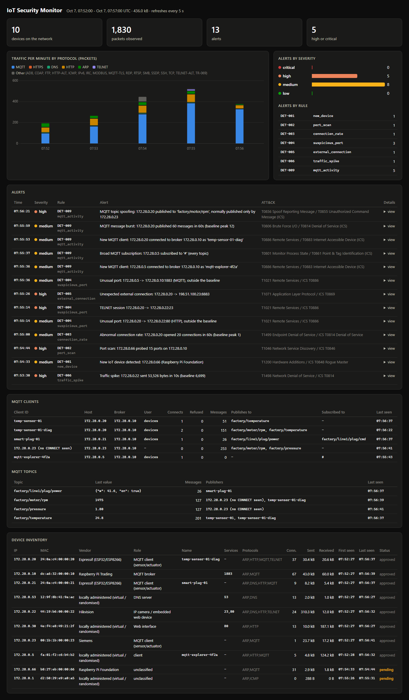

# Week 4: IoT Protocols (MQTT)

**Milestone:** the project monitors IoT protocol activity, not only generic
TCP traffic.

Up to Week 3 the monitor treated MQTT mostly as "TCP to port 1883". That
says a sensor talks to the broker, but not *what* it says. On an IoT or OT
network the interesting events happen inside the protocol: a new client on
the broker, a sensor sending ten times its normal rate, or a device
publishing a reading that belongs to another device. Week 4 adds that
visibility and one rule, DET-009, built on it.

Everything here was run in the Docker lab with simulated devices publishing
harmless telemetry. Full transcripts:
[`week4-mqtt.txt`](sample-output/week4-mqtt.txt) (recorded scenarios) and
[`live-lab-week4.txt`](sample-output/live-lab-week4.txt) (Docker lab).

---

## 1. MQTT in one page

| Concept | What it is | What the monitor uses it for |
|---|---|---|
| **Broker** | Central server (Mosquitto, port 1883; 8883 with TLS) | Every MQTT event is tied to a broker |
| **Client ID** | Name the client sends in `CONNECT` (`temp-sensor-01`) | Identity of the publisher, beyond its IP |
| **Topic** | Hierarchical name (`factory/motor/rpm`) | What the message is about; who "owns" it |
| **PUBLISH** | Client → broker: a value on a topic | Message counts, last value, publishers per topic |
| **SUBSCRIBE** | Client asks for topics; `+` and `#` are wildcards | Who reads what; `#` means every topic |
| **CONNACK** | Broker's answer to `CONNECT` (0 = accepted) | Refused logins (DET-007, Week 3) |
| **Keepalive** | Session stays open for hours or days | Why TCP-level rules barely see a misbehaving sensor |

The last row is the reason for this week. A sensor opens **one** TCP session
and then publishes on it for days. If its firmware starts sending 100
messages a second, or someone uses its credentials to publish fake values,
there is no new connection, no scan and no failure. Only the MQTT layer
shows the change.

## 2. The lab's telemetry

| Device | Client ID | Topic | Value | Every |
|---|---|---|---|---|
| Temperature sensor (172.28.0.20) | `temp-sensor-01` | `factory/temperature` | `24.6` | 5 s |
| Motor drive (172.28.0.23, Siemens OUI) | `motor-drive-01` | `factory/pressure`, `factory/motor/rpm` | `1.8`, `1450` | 2 s |
| Smart plug (172.28.0.21) | `smart-plug-01` | `factory/line1/plug/power`, subscribes to `.../plug/cmd` | `{"w": 41.6, "on": true}` | 10 s |

The motor drive is new this week ([`lab/devices/device.py`](../lab/devices/device.py)).

## 3. What the monitor sees

The parser ([`iotmon/parser.py`](../iotmon/parser.py)) now records every MQTT
control packet in a segment, the client ID, username (never the password),
keepalive, each PUBLISH's topic, value preview, QoS and retain flag, and
each SUBSCRIBE's topics. The MQTT tracker ([`iotmon/mqtt.py`](../iotmon/mqtt.py))
ties packets to sessions and builds the broker's view:

```
$ docker compose exec dashboard python -m iotmon mqtt --db /data/iotmon.db
CLIENT ID                      HOST            BROKER          CONN REFUSED   MSGS  PUBLISHES TO / SUBSCRIBED TO
temp-sensor-01                 172.28.0.20     172.28.0.10        1       0     53  factory/temperature
temp-sensor-01-diag            172.28.0.20     172.28.0.10        2       0    151  factory/motor/rpm, factory/temperature
smart-plug-01                  172.28.0.21     172.28.0.10        1       0     26  factory/line1/plug/power  [sub: factory/line1/plug/cmd]
172.28.0.23 (no CONNECT seen)  172.28.0.23     172.28.0.10        0       0    260  factory/motor/rpm, factory/pressure
mqtt-explorer-4f2a             172.28.0.5      172.28.0.10        1       0      0  -  [sub: #]

TOPIC                            MESSAGES  LAST VALUE               PUBLISHERS
factory/line1/plug/power               26  {"w": 41.6, "on": true}  smart-plug-01
factory/motor/rpm                     131  1475                     172.28.0.23 (no CONNECT seen), temp-sensor-01-diag
factory/pressure                      130  1.81                     172.28.0.23 (no CONNECT seen)
factory/temperature                   203  24.8                     temp-sensor-01, temp-sensor-01-diag
```

This is after the live scenarios, so it already shows the problems: a
second publisher on `factory/motor/rpm`, a diagnostic client on the sensor,
and a workstation subscribed to everything.

Two details worth explaining:

* **`(no CONNECT seen)`**. The motor drive connected to the broker before the
  monitor started sniffing. Its CONNECT, and therefore its client ID, was
  never on the wire while the monitor watched, so it is tracked by IP until
  it reconnects. A passive monitor only knows what it has seen.
* **The same tables are on the dashboard** (MQTT clients, MQTT topics) and in
  SQLite (`mqtt_clients`, `mqtt_topics`), and `/api/mqtt` serves them.

## 4. DET-009: abnormal MQTT activity

The behavioural baseline from Week 3 now also learns, per device, the MQTT
client IDs it connects with, the topics it publishes and subscribes to, and
its busiest 60 s of publishing. Learned in the lab (empty fields omitted):

```
172.28.0.20 {"mqtt_client_ids": ["temp-sensor-01"], "mqtt_publish": ["factory/temperature"], "peak_mqtt_messages": 12}
172.28.0.21 {"mqtt_client_ids": ["smart-plug-01"], "mqtt_publish": ["factory/line1/plug/power"], "mqtt_subscribe": ["factory/line1/plug/cmd"], "peak_mqtt_messages": 6}
172.28.0.23 {"mqtt_client_ids": [], "mqtt_publish": ["factory/motor/rpm", "factory/pressure"], "peak_mqtt_messages": 60}
```

| Check | Anomalous when | Why that threshold | Severity |
|---|---|---|---|
| New client | a host that never used MQTT connects to the broker, or a known host uses a new client ID | Industrial MQTT clients are a fixed set; a new one is a new data path into the process | medium |
| Message burst | publishes in 60 s ≥ max(30, 5 × learned peak) | Telemetry is periodic: the sensor's peak is 12/min, so it needs 60; the drive's is 60, so it needs 300 | medium |
| New topic | a client publishes to a topic outside its baseline | Firmware does not invent topics; capped at 3 alerts per client per 10 min | medium |
| Topic spoofing | a client publishes to a topic that only **other** devices published | Each industrial topic has one source, the device that measures it. A second source feeds false values to whatever reads the topic (ICS T0856) | **high** |
| Subscription | a subscription the client never made; `#` (everything) or `$SYS` (broker internals) | `#` is how a tool maps every tag on the line (ICS T0861) | medium / low |

All of these are relative to each device's own history. None of them is a
fixed list of bad topics or ports.

## 5. Controlled scenarios

Recorded first (deterministic captures, [`tools/generate_scenarios.py`](../tools/generate_scenarios.py)):

```
$ python tools/run_scenarios.py
SCENARIO                       EXPECTED             FIRED                ALERTS  RESULT
...
det-009-new-mqtt-client        DET-004, DET-009     DET-004, DET-009          3  PASS
det-009-message-burst          DET-009              DET-009                   1  PASS
det-009-topic-spoofing         DET-009              DET-009                   1  PASS
near-miss-below-thresholds     none                 none                      0  PASS
iot-lab (full kill chain)      DET-001..007, 009    DET-001..007, 009        12  PASS

10/10 scenarios passed
```

The new-client scenario fires two rules on purpose. DET-004 sees the
transport view ("this laptop never used port 1883"); DET-009 sees the
protocol view ("a new client called `mqtt-explorer-4f2a` subscribed to every
topic"). The second is what an analyst actually needs.

In the kill-chain capture, the rogue Raspberry Pi's credential guessing now
also shows up as what it is at the protocol level, a host that never used
MQTT connecting to the broker:

```
10:36:00  DET-009  MEDIUM  New MQTT client: 192.168.1.66 connected to broker 192.168.1.10 as 'probe-0'
10:36:06  DET-007  HIGH    MQTT authentication failures: 192.168.1.66 refused 5x by broker 192.168.1.10
```

**Then live, in the Docker lab** ([`tools/lab_scenarios.py`](../tools/lab_scenarios.py)):

| Scenario | Runs in | Action |
|---|---|---|
| `det-009-new-mqtt-client` | admin workstation | MQTT client `mqtt-explorer-4f2a` subscribes to `#` for 6 s |
| `det-009-message-burst` | temperature sensor | 150 publishes of `24.6` to `factory/temperature` in 15 s |
| `det-009-topic-spoofing` | temperature sensor | one publish of `0` to `factory/motor/rpm` |

```
== det-009-new-mqtt-client: Admin workstation connects to the broker, subscribes to '#'
   subscribed to '#' for 6 s, saw topics: ['factory/line1/plug/power', 'factory/motor/rpm', 'factory/pressure', 'factory/temperature']
   07:55:36  DET-004  MEDIUM   Unusual port: 172.28.0.5 -> 172.28.0.10:1883 (MQTT), outside the baseline
   07:55:36  DET-009  MEDIUM   New MQTT client: 172.28.0.5 connected to broker 172.28.0.10 as 'mqtt-explorer-4f2a'
   07:55:37  DET-009  MEDIUM   Broad MQTT subscription: 172.28.0.5 subscribed to '#' (every topic)
== det-009-message-burst: Sensor publishes 10 messages/s for 15 s
   07:55:53  DET-009  MEDIUM   New MQTT client: 172.28.0.20 connected to broker 172.28.0.10 as 'temp-sensor-01-diag'
   07:55:59  DET-009  MEDIUM   MQTT message burst: 172.28.0.20 published 60 messages in 60s (baseline peak 12)
== det-009-topic-spoofing: Sensor publishes on the motor drive's rpm topic
   07:56:21  DET-009  HIGH     MQTT topic spoofing: 172.28.0.20 published to 'factory/motor/rpm', normally published only by 172.28.0.23

8/8 live scenarios passed
```

The new-client scenario also shows *why* the rule matters. Six seconds with
`#` and the workstation has listed every topic on the line, with no error
and nothing in the broker's default log. The lab broker uses one shared
account for every device, so the broker could not have stopped the spoofed
rpm value either. Per-client credentials and topic ACLs are the
preventive control; DET-009 is the detective one.

### What the first live run found

Run 1 also passed its scenarios, but raised one extra alert before any
scenario started:

```
1 07:47:44 DET-009 MEDIUM MQTT message burst: 172.28.0.23 published 30 messages in 60s (baseline peak 0)
```

The motor drive publishes two values every 2 s: 60 messages a minute, above
the 30-message floor. I had copied DET-003's learning logic, where anything
above the floor during learning counts as anomalous and is never learned.
That is right for connection attempts, but a high steady message rate is
simply what a fast telemetry device does. The drive was flagged and its
peak was stuck at 29.

The fix: during the learning period DET-009 learns whatever rate it sees and
never alerts on rate. Run 2, from a clean lab, learned a peak of 60 for the
drive and raised no MQTT false positive. There is now a regression test,
`test_high_rate_telemetry_is_learned_not_flagged`. The trade-off is written
down: a burst *during* learning would be learned as normal, which is one
more reason to learn from a reviewed capture (`iotmon baseline learn`).



## 6. Limits and next steps

* **TLS.** With MQTT over TLS (8883), topics and payloads are encrypted, so
  this visibility moves to the broker (its logs or `$SYS` statistics). The
  network view keeps who connects and how much.
* **Values.** The monitor stores the last value per topic but does not judge
  it. Per-topic ranges (rpm outside 1400-1500) are a natural next check.
* **Modbus/TCP** is the optional part of this week, and the next step: the
  same approach (who reads and writes which registers, function codes,
  unit IDs) in a fully simulated lab, linking this project to the
  [OT/ICS lab](https://github.com/kgiannopoulou/ot-ics-cybersecurity-lab). It
  is on the [roadmap](roadmap.md).

## Files

| What | Where |
|---|---|
| MQTT decoding | [`iotmon/parser.py`](../iotmon/parser.py) |
| MQTT tracker (clients, topics, events) | [`iotmon/mqtt.py`](../iotmon/mqtt.py) |
| DET-009 | [`iotmon/detections.py`](../iotmon/detections.py) (`MqttActivityDetector`), thresholds in [`default.toml`](../iotmon/default.toml) |
| MQTT baseline fields | [`iotmon/baseline.py`](../iotmon/baseline.py) |
| CLI, SQLite, dashboard | `iotmon mqtt`, `mqtt_clients` / `mqtt_topics` tables, `/api/mqtt` |
| Lab telemetry | [`lab/devices/device.py`](../lab/devices/device.py) (`temp_sensor`, `motor_drive`), [`lab/docker-compose.yml`](../lab/docker-compose.yml) |
| Scenarios | `samples/scenarios/det-009-*.pcap`, [`lab/scenarios/attacks.py`](../lab/scenarios/attacks.py) (`mqtt-*`) |
| Tests | [`tests/test_mqtt.py`](../tests/test_mqtt.py), [`tests/test_scenarios.py`](../tests/test_scenarios.py) |
