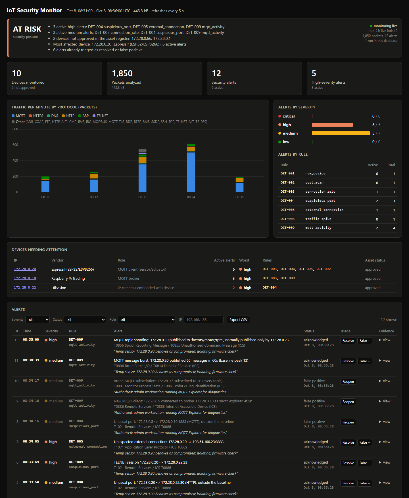

# Week 5: Logging and Security Dashboard

**Milestone:** someone can start the project and understand the security
state without reading raw logs.

By Week 4 the monitor already wrote everything to SQLite and had a web
dashboard. It still couldn't answer the first question anyone asks:
*are we OK right now?* A table of twelve alerts doesn't say which of them
are still a problem, whether anyone has looked at them, or which device to
deal with first. Week 5 turns the log into a security state:

1. **SQLite as the system of record.** Every alert has a triage status and
   an analyst note, every monitoring run is logged, the schema is versioned
   and upgrades itself, and old data can be pruned.
2. **A security posture.** One verdict (CRITICAL / AT RISK / WATCH / OK)
   with the reasons behind it, computed the same way for the terminal and
   the web page.
3. **A dashboard for triage.** The brief's four headline numbers, devices
   ranked by risk, alert filters, triage buttons and CSV export.
4. **A terminal dashboard.** `iotmon status` shows the same view as the
   web page.

Everything below was run in the Docker lab after the eight live scenarios.
Full transcripts: [`live-lab-week5.txt`](sample-output/live-lab-week5.txt)
(Docker lab) and [`week5-status.txt`](sample-output/week5-status.txt)
(sample capture).



---

## 1. The database

The brief asked for three tables: `devices`, `traffic` and `alerts`. They
existed from the start. Week 5 adds what a log needs to stay useful once
people start working with it.

| Table | Contents | Week |
|---|---|---|
| `alerts` | ts, rule, rule_id, severity, title, src, dst, mitre, details (JSON evidence), **run_id, status, note, updated** | 1, 3, **5** |
| `devices` | MAC, IPs, vendor, role, first/last seen, counters, protocols, services, connections, asset status | 1, 2 |
| `traffic` | packets and bytes per minute and application protocol | 1 |
| `flows` | 5-tuple, app, duration, packets/bytes per direction, TCP state | 1 |
| `mqtt_clients`, `mqtt_topics` | the broker's view | 4 |
| **`runs`** | one row per `read` / `live` run: mode, source (pcap or interface), version, started / updated / ended, first / last packet, packets, alerts | **5** |

**Triage status.** Alerts start `open`. An analyst moves them to
`acknowledged` (someone is investigating), `resolved` (handled) or
`false_positive` (not a real problem), with an optional note. Status and
note are stored on the alert row, so the CLI, the dashboard and an export
all show the same thing.

**Runs.** The monitor updates its run row on every commit (every 2 s) and
marks it ended on a clean shutdown. `docker compose stop monitor` sends
SIGTERM, and the run shows as finished. A run that stops updating without
an end time is shown as "monitor stopped", which is how the dashboard tells
a live sensor from a dead one.

**Schema upgrades.** `PRAGMA user_version` holds the schema version (5).
Opening an older database adds the missing columns in place
(`ADDED_COLUMNS` in [`storage.py`](../src/iotmon/storage.py)), so a Week 4 lab
database keeps its data. A test builds a pre-Week 5 database by hand and
checks the upgrade.

**Retention.** `iotmon db prune --keep-days 30` deletes alerts, flows and
traffic older than the cut-off, measured in packet time so a replayed
capture from last year doesn't vanish on import. Devices, MQTT state and
runs are kept: they are the inventory and the audit trail, and they stay
small.

**Concurrency.** The monitor and the dashboard are separate processes (and
separate containers in the lab) sharing one SQLite file in WAL mode. Both
open it with a 10 s busy timeout. The dashboard's only write is a
one-row triage update. In the live run I triaged twelve alerts from the
dashboard container while the monitor kept committing, and there were no
lock errors.

```
$ iotmon db info
database   /data/iotmon.db (3335 KiB)
schema     version 5

TABLE            ROWS
alerts             12
devices            10
flows              85
mqtt_clients        5
mqtt_topics         4
runs                1
traffic            40

 RUN  MODE  STARTED              DURATION   PACKETS ALERTS  SOURCE
   1  live  2026-10-08 08:31:04     292 s      1915     12  iotlab0
```

## 2. The security posture

The posture is a plain rule rather than a score, so it can be explained in
one sentence ([`state.py`](../src/iotmon/state.py)):

| Posture | When |
|---|---|
| **CRITICAL** | at least one active critical alert |
| **AT RISK** | at least one active high alert |
| **WATCH** | active medium/low alerts, or devices not approved in the asset register |
| **OK** | nothing that needs attention |
| **NO DATA** | nothing analysed yet |

*Active* means open **or acknowledged**. Acknowledging an alert says
someone is on it, not that the risk is gone. A compromised sensor stays a
problem until someone resolves the alert, so only `resolved` and
`false_positive` stop an alert from counting. The posture always lists its
reasons: which rules are behind the active alerts, which devices are
unapproved, and which device is most affected.

**Devices needing attention.** Active alerts are attributed to the local
devices they name. The source gets the full severity weight (critical 10,
high 5, medium 2, low 1) and the destination half: the scanned camera
matters, but the Raspberry Pi doing the scanning matters more. Devices are
ranked by that score and shown with their worst severity and the rules
involved.

## 3. Triage in the live lab

After the eight live scenarios the lab had twelve alerts. Each was triaged
the way an analyst would handle it:

```
$ iotmon alerts fp 1 --note "Known lab-start FP: camera upload + admin snapshot share a 10 s bucket (roadmap)"
$ iotmon alerts resolve 2 3 --note "Rogue Pi 172.28.0.66 removed from the network"
$ iotmon alerts fp 8 9 10 --note "Authorised: admin workstation running MQTT Explorer for diagnostics"
$ iotmon alerts ack 4 5 6 7 11 12 --note "Temp sensor 172.28.0.20 behaves as compromised; isolating, firmware check"
```

The first one went through the dashboard's triage API, before the
scenarios ran. Alert 1 is the camera `traffic_spike` false positive at
lab start that has been on the [roadmap](roadmap.md) since Week 3. Now it
can be closed with a reason instead of sitting in the list forever.

```
$ iotmon status
IOT SECURITY MONITOR                                                                posture: AT RISK
────────────────────────────────────────────────────────────────────────────────────────────────────
Devices monitored                     10   2 not approved
Packets analyzed                   1,786   417.5 kB
Security alerts                       12   6 active
High-severity alerts                   5   3 active
Traffic window                             2026-10-08 08:31 - 08:36 UTC
Last run                              #1   live iotlab0 (running, 1,786 packets)

Why AT RISK
────────────────────────────────────────────────────────────────────────────────────────────────────
  - 3 active high alerts: DET-004 suspicious_port, DET-005 external_connection, DET-009
    mqtt_activity
  - 3 active medium alerts: DET-003 connection_rate, DET-004 suspicious_port, DET-009 mqtt_activity
  - 2 devices not approved in the asset register: 172.28.0.66, 172.28.0.1
  - Most affected device: 172.28.0.20 (Espressif (ESP32/ESP8266)), 6 active alerts
  - 6 alerts already triaged as resolved or false positive

Devices needing attention
────────────────────────────────────────────────────────────────────────────────────────────────────
  IP              VENDOR                     ALERTS  WORST     RULES
  172.28.0.20     Espressif (ESP32/ESP8266)       6  HIGH      DET-003, DET-004, DET-005, DET-009
  172.28.0.10     Raspberry Pi Trading            3  HIGH      DET-003, DET-009
  172.28.0.22     Hikvision                       2  HIGH      DET-004

Recent Alerts
────────────────────────────────────────────────────────────────────────────────────────────────────
    12 08:35:00  HIGH     DET-009  MQTT topic spoofing: 172.28.0.20 published to ...  [acknowledged]
    11 08:34:39  MEDIUM   DET-009  MQTT message burst: 172.28.0.20 published 65 m...  [acknowledged]
    ...
```

This is the milestone. Without opening a log, the screen says that the
network is at risk, because the temperature sensor is still behaving like a
compromised device (acknowledged, not resolved). The rogue Pi incident is
closed. Two devices still need an asset decision. Six alerts were already
dealt with, and each one carries a note saying why.

The two unapproved devices are worth explaining. 172.28.0.66 is the rogue
Pi. Removing it closed its alerts, but approving it in the asset register
is a separate decision, and the right answer here is to leave it pending.
172.28.0.1 is the Docker bridge gateway. It first appeared at 08:34:05, the
same second as the sensor's TTL-1 probe to the internet in the DET-005
scenario (the gateway answers that probe with an ICMP time-exceeded). That
was after the register's bootstrap window, so it waits for a human to
approve it. That is the asset register doing its job, not noise.

## 4. The dashboard

[`src/iotmon/dashboard/`](../src/iotmon/dashboard) now opens with the answer:

* **Posture banner.** The level, its reasons, and the monitor's state
  (live with a green dot, finished, or stopped) with the current run.
* **The brief's four numbers.** Devices monitored (and how many are not
  approved), packets analyzed (and bytes), security alerts and
  high-severity alerts, each with its active count.
* **Alerts by severity and rule.** Shown as active / total.
* **Devices needing attention.** Clicking an IP filters the alert list to
  that device's active alerts.
* **Alerts.** Filter by severity, status (including "active"), rule and IP.
  Each alert has *Ack / Resolve / False +* (or *Reopen*), the evidence JSON
  and a note field. *Export CSV* downloads exactly the filtered view. The
  5-second refresh skips the table while you are typing a note.
* MQTT clients/topics and the device inventory, as before.


**Security of the triage API.** `POST /api/alerts/<id>` changes data, so it
is protected against cross-site requests. It accepts only
`application/json`, which a browser cannot send cross-origin without a
CORS preflight that this app never approves. It also rejects any request
whose `Origin` header names another host. Both checks have tests. The
dashboard binds to 127.0.0.1 by default (and to `127.0.0.1:8080` on the
host in the lab), has no login, and can be started with `--read-only` to
remove triage entirely. A shared deployment would need authentication in
front of it.

| Endpoint | Purpose |
|---|---|
| `GET /api/state` | posture, headline numbers, devices needing attention, recent alerts, current run |
| `GET /api/alerts?severity=&status=&rule=&ip=` | filtered alerts, newest first (`status=active` = open + acknowledged) |
| `POST /api/alerts/<id>` | `{"status": "acknowledged", "note": "..."}` |
| `GET /api/alerts.csv?...` | the same filters as a CSV download |
| `GET /api/runs` | monitoring runs |
| `GET /api/summary`, `/api/devices`, `/api/traffic`, `/api/mqtt`, `/api/flows` | as before (`summary` now includes the posture) |

## 5. CLI

| Command | Purpose |
|---|---|
| `iotmon status` | the terminal dashboard above. `-w 5` redraws every 5 s, `--json` gives the full state, `-n` sets how many recent alerts to show |
| `iotmon alerts [list]` | query the log: `--severity`, `--status` (or `active`), `--rule DET-002` / `port_scan`, `--ip`, `--since 6h` / ISO date, `--json` |
| `iotmon alerts ack\|resolve\|fp\|reopen ID... [--note]` | triage |
| `iotmon alerts export [-o FILE] [--format csv\|json]` | the filtered alerts, oldest first, with status, note and evidence, for a report or a SIEM |
| `iotmon db info` | schema version, rows per table, monitoring runs |
| `iotmon db prune --keep-days N` / `--before DATE` | retention |

`iotmon status` falls back to plain dashes on consoles that can't print
box-drawing characters (the default Windows code page), and it fits its
output to the terminal width (78 to 120 columns).

## 6. Tests

[`tests/test_logging_dashboard.py`](../tests/test_logging_dashboard.py)
adds eleven tests (99 in total): run logging, triage (including notes kept
across status changes), upgrading a hand-built Week 4 database, retention,
reset, every posture level including "acknowledged still counts", the
device-risk weighting, the state and terminal rendering of the sample
capture, the `status` / `alerts` / `export` / `db info` commands end to
end, the dashboard's filters, triage, CSV export and cross-site checks,
and read-only mode.

## 7. Limits and next steps

* **No users.** Triage records *what* and *why* but not *who*. With
  authentication in front of the dashboard, the user would go in an
  `alert_history` table (status changes over time), which would also give
  time-to-acknowledge and time-to-resolve metrics.
* **Alert grouping.** Six alerts about one compromised sensor are one
  incident. Grouping by device and time window into incidents is the
  natural step after triage.
* **A false positive doesn't tune anything.** Marking the camera spike as a
  false positive closes it, but the rule will fire again on the next lab
  start. Feeding false positives back into thresholds or allowlists is on
  the roadmap.
* **SQLite is single-node.** That is fine for one sensor. Several sensors
  would ship `alerts.jsonl` to Wazuh or Elastic (also on the roadmap) and
  keep this dashboard as the local view.

## Files

| What | Where |
|---|---|
| Schema, runs, triage, upgrades, retention | [`src/iotmon/storage.py`](../src/iotmon/storage.py) |
| Posture, device risk, alert queries, terminal view, export | [`src/iotmon/state.py`](../src/iotmon/state.py) |
| Dashboard API and page | [`src/iotmon/dashboard/app.py`](../src/iotmon/dashboard/app.py), [`templates/index.html`](../src/iotmon/dashboard/templates/index.html) |
| CLI | [`src/iotmon/cli.py`](../src/iotmon/cli.py) (`status`, `alerts`, `db`) |
| Tests | [`tests/test_logging_dashboard.py`](../tests/test_logging_dashboard.py) |
| Transcripts | [`live-lab-week5.txt`](sample-output/live-lab-week5.txt), [`week5-status.txt`](sample-output/week5-status.txt) |
