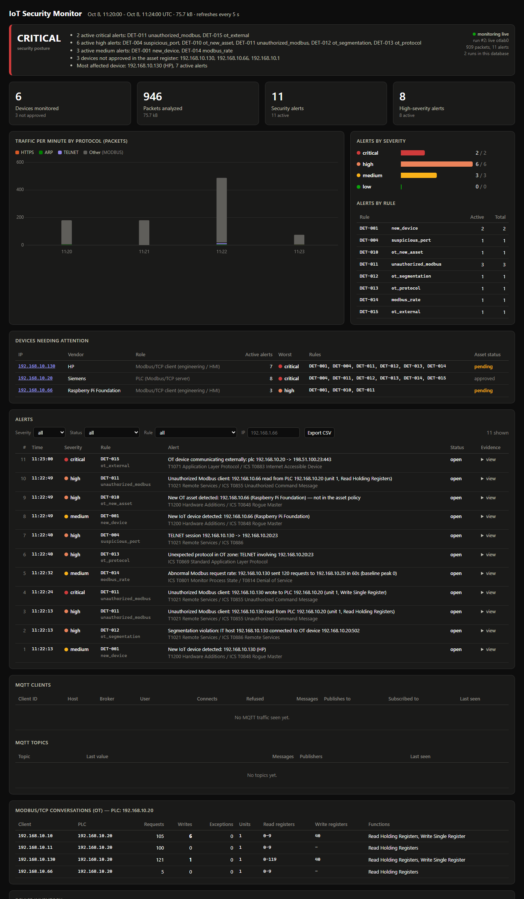

# Week 7: Industrial / OT Security Expansion

**Goal:** make the monitor understand an industrial control network, not just
IoT: decode Modbus/TCP, model OT zones and a communication policy, and detect
the things that matter on a control network — unauthorized access to a PLC,
segmentation crossings, and a PLC reaching the internet.

This connects the three threads of the project: **network security + IoT +
OT/ICS**. The same passive monitor now watches a simulated factory floor.



---

## 1. The network

```
                        OT SECURITY LAB  (one monitored switch)

            IT zone                    OT zone  (control network)
     192.168.10.128/25          192.168.10.0/25
     ┌───────────────┐      ┌───────────┬───────────┬──────────────┐
     │  office PC    │      │    PLC    │    HMI    │  Engineering │
     │ 192.168.10.130│      │   .20     │   .11     │  workstation │
     └───────┬───────┘      │ Modbus    │           │   .10        │
             │              │ /TCP :502 │           │              │
             │              └─────┬─────┴─────┬─────┴──────┬───────┘
             │                    │           │            │
             └──────────▶ ◀───────┴───────────┴────────────┘
                     ▲  Modbus/TCP read & write
                     │
           ┌─────────┴──────────┐
           │  IoT Security      │   passive, SPAN-style capture
           │     Monitor        │
           └────────────────────┘
```

The zones are **logical**, by IP address, so the whole lab fits on one
monitored bridge: the control devices sit in the lower half of the subnet
(OT), the office PC in the upper half (IT). A connection from the office PC
to the PLC is therefore a zone crossing even though they share a switch —
which is exactly how a flat, poorly segmented OT network looks in practice.

Everything is simulated ([`simulator/ot_devices.py`](../simulator/ot_devices.py),
a Modbus/TCP PLC and its clients in ~150 lines of standard-library Python).
No real PLCs, and nothing leaves the lab.

## 2. Modbus/TCP awareness

Modbus is the most common OT protocol and has **no authentication**: any host
that can reach a PLC on port 502 can read or write the registers and coils
that drive the physical process. The monitor now decodes it
([`src/iotmon/modbus.py`](../src/iotmon/modbus.py)): the MBAP header, the unit
ID, the function code (read vs write), and the register ranges touched. The
`ModbusTracker` builds a per-conversation view, the OT equivalent of the MQTT
tracker:

```
$ iotmon modbus
MODBUS/TCP (OT)  (PLC servers: 192.168.10.20)
CLIENT          -> PLC               REQ   WR  EXC  UNITS    READ REG     WRITE REG  FUNCTIONS
192.168.10.10   -> 192.168.10.20     102    6    0  1        0-107        40         Read Holding Registers, Write Single Register
192.168.10.11   -> 192.168.10.20     240    0    0  1        0-9          -          Read Holding Registers
192.168.1.50    -> 192.168.10.20     153    1    0  1        0-1499       40         Read Holding Registers, Write Single Register
```

At a glance: the engineering workstation reads and writes the setpoint
(register 40), the HMI only reads, and `192.168.1.50` — a host that should not
be talking Modbus at all — has read a huge register range and written one.

## 3. Asset inventory with roles, zones and risk

The inventory now records each device's **zone** (OT / IT), a
**`device_type`** (PLC, HMI, EWS, IoT sensor, …), and a **`risk_score`**
(0-100). The score is a documented heuristic, not a probability: a device's
zone and role set the baseline (OT 45, a PLC +25), and exposure raises it
(an open Telnet port +15, talking to the internet +15, not yet reviewed +10).
It ranks the asset register so the most important device to protect — the PLC
— sits at the top:

```
IP              ZONE  TYPE           RISK VENDOR    ROLE
192.168.10.20   OT    PLC             100 Siemens   PLC (Modbus/TCP server)
192.168.10.11   OT    HMI              57 Siemens   HMI panel
192.168.10.10   OT    EWS              57 HP        Engineering workstation
192.168.1.50    IT    Modbus client    15 HP        Modbus/TCP client
```

## 4. Baselining expected behaviour: zones and a policy

The core OT concept is **segmentation**: only certain conversations should
cross into the control network. That is expressed as a small policy in
[`config.yaml`](../config.yaml) — the `allowed_connections` idea from the
brief, by role:

```yaml
ot:
  zones:
    OT: ["192.168.10.0/24"]
    IT: ["192.168.1.0/24"]
  assets:
    "192.168.10.20": {role: plc, label: "Line 1 PLC"}
    "192.168.10.10": {role: engineering_workstation}
    "192.168.10.11": {role: hmi}
  policy:
    allow:                       # initiator role -> target roles
      engineering_workstation: [plc, hmi]
      hmi: [plc]
      plc: [hmi]
  modbus:
    allowed_clients: [engineering_workstation, hmi]
    writers: [engineering_workstation]
  expected_protocols: [MODBUS, ARP, NTP, ICMP]
```

So `engineering_workstation -> plc` is allowed, `hmi -> plc` is allowed, and
anything else into OT — `office_pc -> plc`, `camera -> plc`, `unknown -> plc`
— is a violation. [`src/iotmon/policy.py`](../src/iotmon/policy.py) answers the
two questions the detectors ask: *which zone is this device in?* and *is this
connection allowed?* With no `ot:` section the OT rules simply never fire, so
IoT-only deployments are unchanged.

## 5. The OT detections (DET-010 to DET-015)

The brief lists six OT rules. They sit after the nine IoT rules, so the IDs
continue from DET-010 (the brief re-uses DET-006..011 for a simpler project):

| ID | Rule | Fires on | ATT&CK (ICS) |
|---|---|---|---|
| DET-010 | `ot_new_asset` | a device appears in the OT zone, or starts answering Modbus (a PLC), and is not declared | T0848 Rogue Master |
| DET-011 | `unauthorized_modbus` | a Modbus client the policy does not allow — reading is high, **writing is critical** | T0855 Unauthorized Command Message, T0836 Modify Parameter |
| DET-012 | `ot_segmentation` | a host outside OT opens a connection into OT that the policy forbids (IT→PLC) | T0886 Remote Services |
| DET-013 | `ot_protocol` | an unexpected protocol inside OT (Telnet, HTTP, MQTT reaching a PLC) | T0869 Standard Application Layer Protocol |
| DET-014 | `modbus_rate` | far more Modbus requests than the baseline (a polling flood or register enumeration) | T0801 Monitor Process State, T0814 Denial of Service |
| DET-015 | `ot_external` | an OT device opens a connection to the internet (PLC→C2 is critical) | T0883 Internet Accessible Device |

The design is the same as the IoT rules: a policy or a learned baseline, a
threshold with a reason, and an evidence record per alert. DET-011's
read-vs-write split is the OT-specific insight — reading a PLC is
reconnaissance, writing it changes the physical process, so the severities
differ.

## 6. Demonstration

### The deterministic sample capture

[`samples/ot-lab.pcap`](../samples) is a synthetic, byte-identical capture
([`tools/generate_ot_pcap.py`](../tools/generate_ot_pcap.py)): five minutes of
normal Modbus polling, then the attacks. The monitor's output is the
full OT story, with **zero alerts during the baseline**:

```
10:35:05  [HIGH]     DET-012 Segmentation violation: IT host 192.168.1.50 connected to OT device 192.168.10.20:502
10:35:05  [HIGH]     DET-011 Unauthorized Modbus client: 192.168.1.50 read from PLC 192.168.10.20 (Read Holding Registers)
10:35:20  [CRITICAL] DET-011 Unauthorized Modbus client: 192.168.1.50 wrote to PLC 192.168.10.20 (Write Single Register)
10:35:35  [HIGH]     DET-010 New OT asset detected: 192.168.10.66 — not in the asset policy
10:35:50  [HIGH]     DET-011 Unauthorized Modbus client: 192.168.10.66 read from PLC 192.168.10.20
10:36:05  [MEDIUM]   DET-014 Abnormal Modbus request rate: 192.168.1.50 sent 120 requests in 60s (baseline peak 0)
10:36:20  [HIGH]     DET-013 Unexpected protocol in OT zone: TELNET involving 192.168.10.20:23
10:36:35  [CRITICAL] DET-015 OT device communicating externally: plc 192.168.10.20 -> 198.51.100.23:443
```

### The live Docker lab

[`lab/ot/`](../lab/ot) brings the whole thing up for real:

```bash
cd lab/ot && docker compose up -d --build     # PLC, EWS, HMI, office PC, monitor, dashboard
# wait ~2 min for the monitor to learn the baseline, then:
python tools/ot_lab_scenarios.py              # run the attacks from inside the lab
```

The engineering workstation and HMI poll the real simulated PLC over Modbus;
the attacks run from inside the office-PC container and a short-lived rogue
device. All six rules fire ([transcript](sample-output/live-lab-week7.txt)):

```
SCENARIO                   EXPECTED             FIRED                RESULT
det-012-segmentation       DET-011,DET-012      DET-011,DET-012      PASS
det-011-write              DET-011              DET-011              PASS
det-014-modbus-flood       DET-014              DET-014              PASS
det-013-telnet             DET-013              DET-013              PASS
det-010-rogue-asset        DET-010              DET-010              PASS
det-015-plc-external       DET-015              DET-015              PASS

6/6 OT scenarios passed
```

This is the Week 7 deliverable end to end: **simulated engineering
workstation → Modbus/TCP → simulated PLC → monitoring → detection**, and the
IoT MQTT path from the earlier weeks still runs unchanged.

## 7. What this adds for an interview

* **Segmentation and allowlisted communication.** The Purdue model (IT vs OT
  zones) and a default-deny policy into the control network, expressed as a
  few lines of config and checked on every connection.
* **Protocol-aware OT monitoring.** Reading a PLC is reconnaissance; writing
  it is an attack on the physical process. The monitor tells them apart
  because it decodes Modbus function codes, not just "TCP to port 502".
* **Asset-centric risk.** Zones, device types and a risk score turn a packet
  capture into an asset inventory an OT defender can act on.

## 8. Limits and next steps

* **Modbus only.** DNP3, EtherNet/IP and S7comm are the obvious next
  protocols; the tracker and rules are structured to take more.
* **No deep payload checks.** The monitor sees *that* register 40 was written,
  not whether 9999 RPM is a safe value. Per-register range checks (an rpm
  outside 1400-1500) are a natural next rule.
* **Policy is static.** The allowlist is written by hand. Learning a first
  draft from a trusted capture, then having an engineer approve it, is the
  realistic workflow.
* **Simulated devices.** Validating against a real PLC (or a vendor
  simulator) and a SPAN port is the step toward a real deployment. This links
  to the [OT/ICS lab](https://github.com/kgiannopoulou/ot-ics-cybersecurity-lab).

## Files

| What | Where |
|---|---|
| Modbus decoding and tracker | [`src/iotmon/modbus.py`](../src/iotmon/modbus.py), [`parser.py`](../src/iotmon/parser.py) |
| Zones and the communication policy | [`src/iotmon/policy.py`](../src/iotmon/policy.py), [`config.yaml`](../config.yaml) |
| OT detectors (DET-010..015) | [`src/iotmon/detections.py`](../src/iotmon/detections.py) |
| Zone / type / risk on assets | [`src/iotmon/inventory.py`](../src/iotmon/inventory.py) |
| CLI and dashboard | `iotmon modbus`, `/api/modbus`, device zone/risk columns |
| Simulated OT devices and attacks | [`simulator/ot_devices.py`](../simulator/ot_devices.py), [`simulator/ot_attacks.py`](../simulator/ot_attacks.py) |
| Lab and scenarios | [`lab/ot/`](../lab/ot), [`tools/ot_lab_scenarios.py`](../tools/ot_lab_scenarios.py), [`tools/generate_ot_pcap.py`](../tools/generate_ot_pcap.py) |
| Tests | [`tests/test_ot.py`](../tests/test_ot.py) |
| Transcript | [`live-lab-week7.txt`](sample-output/live-lab-week7.txt) |
