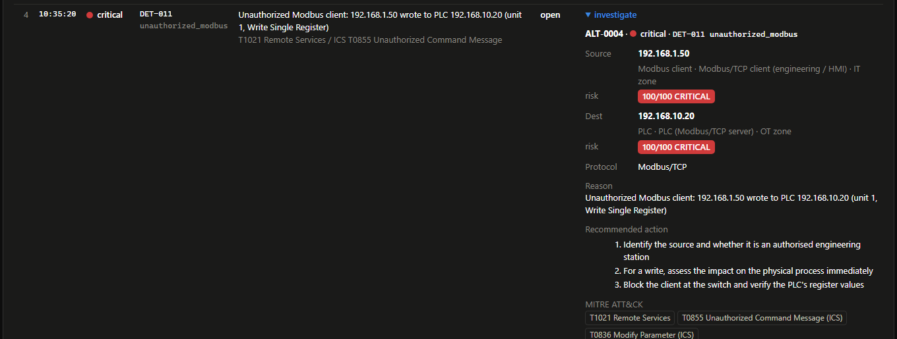
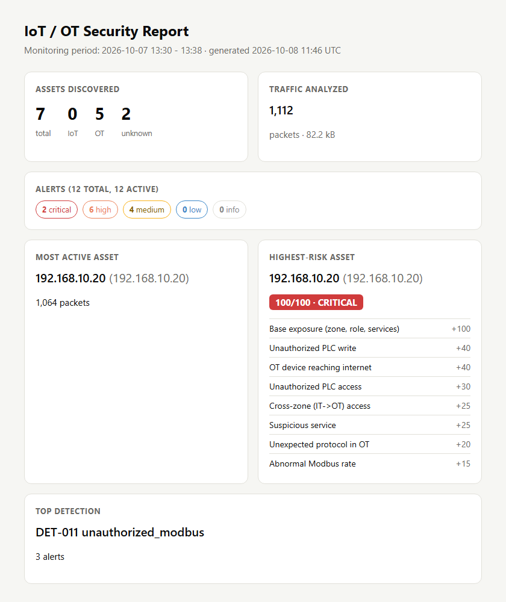

# Week 8: From Monitor to SOC Analyst Tool

**Goal:** make the system behave like something a security analyst could
actually use — not just "an alert fired", but *how bad is it, why, what do I
do, and where's the evidence*. Six additions turn detections into
investigations.



---

## 1. Five severity levels

The scale is now **INFO · LOW · MEDIUM · HIGH · CRITICAL**
([`models.py`](../src/iotmon/models.py)). INFO is the new one: a
non-actionable notice (a client subscribed to a new MQTT topic, say) that is
recorded and visible but **never raises the security posture**. Everything
LOW and above needs a human. Examples from this project:

| Event | Severity |
|---|---|
| New MQTT subscription to a single topic | INFO |
| Known MAC on a new IP (DHCP churn) | LOW |
| New unknown IoT device | MEDIUM |
| Port scan / unauthorized PLC read | HIGH |
| PLC connecting to the internet / unauthorized PLC write | CRITICAL |

## 2. Risk scoring (a documented heuristic, not a standard)

Each asset gets a **0–100 risk score** with a status band (INFO / LOW /
MEDIUM / HIGH / CRITICAL). This is *this project's* model, not a universal
cybersecurity standard. It combines two things ([`state.py`](../src/iotmon/state.py)):

* **Base exposure** — the asset's intrinsic risk from Week 7: its zone, role
  and open services (an OT PLC with an exposed Telnet port starts high).
* **Active-alert points** — each kind of active finding against the asset adds
  points, deduplicated by category, exactly like the brief's example:

```
PLC-01 (192.168.10.20)
────────────────────────────────────
Base exposure (zone, role, services) +100
Unauthorized PLC write                +40
OT device reaching internet           +40
Unauthorized PLC access               +30
Cross-zone (IT->OT) access            +25
...
────────────────────────────────────
Risk Score  100/100   CRITICAL
```

The score ranks the asset register and drives the "devices needing
attention" and the report's highest-risk asset. The point values are
documented in [`state.py`](../src/iotmon/state.py) (`ALERT_RISK`).

## 3. MITRE ATT&CK mapping, verified, with a response playbook

Every rule already carried verified ATT&CK (Enterprise) and ATT&CK for ICS
techniques — the test [`test_rules_config.py`](../tests/test_rules_config.py)
fails if an alert ever raises a technique not declared for its rule, so the
mappings can't drift. Week 8 adds a **`response:`** block to each rule in
[`rules/detection_rules.yaml`](../rules/detection_rules.yaml): the concrete
steps an analyst should take. For DET-011 (unauthorized Modbus):

```yaml
rule_id: DET-011
name: Unauthorized Modbus client
severity: [high, critical]
attack: ["T1021 Remote Services", "T0855 Unauthorized Command Message (ICS)",
         "T0836 Modify Parameter (ICS)"]
response:
  - Identify the source and whether it is an authorised engineering station
  - For a write, assess the impact on the physical process immediately
  - Block the client at the switch and verify the PLC's register values
```

Techniques were checked against the live ATT&CK and ATT&CK for ICS matrices
before being used; a correct handful matters more than a long, shaky list.

## 4. The analyst alert view

An alert on its own ("abnormal connection rate") doesn't tell an analyst
enough to act. `iotmon alert <id>` (and the dashboard's **investigate**
expander) builds the full investigation card: both endpoints resolved to a
name, role, zone and risk score, the protocol, the reason, the recommended
actions and the ATT&CK techniques.

```
$ iotmon alert 4
SECURITY ALERT
----------------------------------------------------------------
Alert ID:     ALT-0004
Severity:     CRITICAL
Rule:         DET-011  unauthorized_modbus
Source:
  192.168.1.50
  Modbus client / Modbus/TCP client (engineering / HMI) / IT zone
  risk 100/100 CRITICAL
Destination:
  192.168.10.20
  PLC / PLC (Modbus/TCP server) / OT zone
  risk 100/100 CRITICAL
Protocol:     Modbus/TCP
Reason:
  Unauthorized Modbus client: 192.168.1.50 wrote to PLC 192.168.10.20
Recommended action:
  1. Identify the source and whether it is an authorised engineering station
  2. For a write, assess the impact on the physical process immediately
  3. Block the client at the switch and verify the PLC's register values
MITRE ATT&CK:
  - T1021 Remote Services
  - T0855 Unauthorized Command Message (ICS)
  - T0836 Modify Parameter (ICS)
PCAP: samples/ot-lab.pcap  (iotmon pcap 4 -o alert.pcap)
```

On the dashboard, each alert has an **investigate** panel with the same card,
and `#alert=<id>` deep-links straight to it (so an analyst can share a link).
This is the difference between *detecting* something unusual and giving an
analyst enough context to *investigate* it.

## 5. PCAP investigation

Every `read` run records its source capture, so an alert can be traced back to
the packets that caused it. `iotmon pcap <id>` carves them out
([`pcaptools.py`](../src/iotmon/pcaptools.py)) — every packet involving the
alert's source or destination within a time window — into a `.pcap` to open in
Wireshark:

```
$ iotmon pcap 4 -o alert.pcap
wrote 122 packets around ALT-0004 (192.168.1.50, 192.168.10.20) to alert.pcap
```

The investigation workflow is now closed end to end:

```
alert → identify source/destination → review related traffic
      → inspect PCAP in Wireshark → determine why the rule fired → document
```

This combines the Python automation with real packet analysis rather than
treating them as separate skills. (A live capture isn't retained, so carving
only works on alerts from `iotmon read FILE.pcap`; the command says so.)

## 6. The security report

`iotmon summary` turns the database into a SOC-style report — text, Markdown,
JSON, or a standalone HTML page ([`--format html`](../screenshots/security-report.png)):

```
IoT/OT SECURITY REPORT
============================================================
Monitoring period
  2026-10-07 10:30 - 10:38 UTC

Assets discovered:               7
  IoT devices:                   0
  OT devices:                    5
  Unknown devices:               2

Traffic analyzed:            1,112  (82.2 kB)

Alerts
  Critical: 2   High: 6   Medium: 4   Low: 0   Info: 0

Most Active Asset    192.168.10.20  (1,064 packets)
Highest Risk Asset   192.168.10.20  PLC  —  100/100 CRITICAL
Top Detection        DET-011 unauthorized_modbus  (3 alerts)
```



The Python is no longer just detecting packets — it is turning network
telemetry into security information a manager or an analyst can read.

## What the system became

```
 IoT sensors ──MQTT──┐
 HMI ────────────────┤
 Engineering PC ─────┼──► Network monitor ──► Asset discovery ──► Detection
 PLC ───Modbus/TCP───┘                                               │
                        ┌───────────────┬──────────────┬─────────────┤
                        ▼               ▼              ▼              ▼
                     Alerts         Database        PCAP/logs    Risk / enrichment
                        └───────────────┴──────────────┴─────────────┘
                                          ▼
                                   SOC dashboard
                                 ┌────────┴────────┐
                                 ▼                 ▼
                           Investigation         Reports
```

The repository now demonstrates Python, TCP/IP, packet analysis, MQTT,
Modbus/TCP, IoT asset discovery, OT/ICS concepts, detection engineering,
alerting and triage, SQLite, Docker, testing, PCAP analysis, risk scoring,
MITRE ATT&CK / ICS mapping, and security documentation.

## Files

| What | Where |
|---|---|
| INFO severity | [`models.py`](../src/iotmon/models.py), [`state.py`](../src/iotmon/state.py) |
| Risk model (base + alert points, status bands) | [`state.py`](../src/iotmon/state.py) (`enrich_risk`, `ALERT_RISK`) |
| Response playbooks | [`rules/detection_rules.yaml`](../rules/detection_rules.yaml) (`response:`) |
| Analyst alert view | `iotmon alert`, `/api/alert/<id>`, dashboard investigate panel |
| PCAP carving | [`pcaptools.py`](../src/iotmon/pcaptools.py), `iotmon pcap` |
| Security report | [`state.py`](../src/iotmon/state.py), `iotmon summary`, `/api/report` |
| Tests | [`tests/test_analyst.py`](../tests/test_analyst.py) |
| Transcripts | [`week8-alert.txt`](sample-output/week8-alert.txt), [`week8-report.txt`](sample-output/week8-report.txt) |
