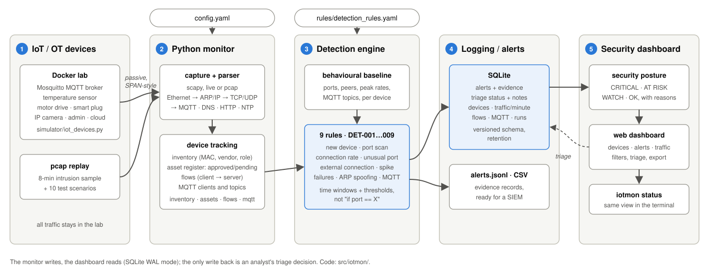

# Architecture



Data flow in more detail (all modules are in `src/iotmon/`):

```
  pcap file ──┐                      ┌──▶ Inventory   (devices: MAC, vendor, role, connections) ◀─▶ inventory.json
              ├─▶ capture ─▶ parser ─┼──▶ FlowTable   (bidirectional conversations)
  interface ──┘   (scapy)  (Packet-  ├──▶ Detection   (DET-001..009, packet-time windows) ──▶ alerts
                            Record)  │      Engine  ◀─▶ Baseline (per-device behaviour) ◀─▶ baseline.json
                                     └──▶ Printer     (terminal table + coloured alerts)
                                                │
                                   Storage ◀────┘  SQLite (alerts + triage, devices, flows, traffic/min, mqtt, runs)
                                      │            alerts.jsonl  (one JSON object per alert)
                                      │            packets.csv   (optional, --csv)
                                      ▼
                                   state.py  (posture, device risk, alert queries)
                                   │       │
                   Flask dashboard ◀┘       └▶ iotmon status / alerts / db
                   (separate process; only write: alert triage)
```

## Modules

| Module | Responsibility |
|---|---|
| `capture.py` | `read_pcap()` and `sniff_live()`. Both yield `PacketRecord`s, so everything downstream is identical for replay and live capture. Live capture runs scapy's `AsyncSniffer` in its own thread and hands packets over through a queue. |
| `parser.py` | scapy packet → `PacketRecord`: link, network, transport, application. Decodes MQTT (CONNECT/CONNACK/PUBLISH/SUBSCRIBE), DNS, HTTP, NTP, ICMP, and labels TLS as encrypted. Never raises on malformed payloads. |
| `config.py` | Loads [`config.yaml`](../config.yaml) (site settings) and [`rules/detection_rules.yaml`](../rules/detection_rules.yaml) (rule catalogue and thresholds), validates the rules, and merges a site config (`--config`) over both. See [Week 6](06-project-presentation.md). |
| `models.py` | `PacketRecord`, `Alert` (and its evidence-record JSON form), the rule-ID catalogue (registered from the rule file), the known-services table, the service-port rule. |
| `flows.py` | Groups packets into client→server flows with idle expiry and TCP state (ESTABLISHED / CLOSED / REJECTED / NO-REPLY). |
| `inventory.py` | Passive asset inventory: MAC-keyed devices, OUI vendor lookup, role inference from offered services and MQTT behaviour, connection counts, MAC/IP binding changes. |
| `assets.py` | Persistent asset register (`data/inventory.json`): known devices keyed by MAC with status approved / pending, merged after each run (replay-safe), saved every 30 s during live capture. See [Week 2](02-device-inventory.md). |
| `baseline.py` | Behavioural baseline (`data/baseline.json`): per device, the ports it uses and serves, its internet peers and its peak connection rate. Learned during the learning period or from a trusted capture, then frozen. See [Week 3](03-detection-engine.md). |
| `mqtt.py` | MQTT tracker: maps MQTT packets to client IDs and brokers, keeps per-client and per-topic statistics (messages, last value, publishers, subscriptions) and emits connect/publish/subscribe events for DET-009. See [Week 4](04-iot-protocols.md). |
| `detections.py` | `DetectionEngine` plus nine `Detector` subclasses (DET-001 to DET-009). The engine tells each detector whether the packet opened a connection and whether the baseline is still learning, and remembers which rules fired for which source. See [detection-rules.md](detection-rules.md). |
| `storage.py` | SQLite in WAL mode (monitor and dashboard share the file), JSONL alerts for SIEM ingestion, optional CSV. Writes are batched and committed every 2 s, together with the run's progress. Versioned schema with in-place upgrades, alert triage (`set_alert_status`) and retention (`prune`). |
| `state.py` | Security state from the database: posture (CRITICAL / AT RISK / WATCH / OK) with reasons, devices ranked by active alerts, filtered alert queries, the `iotmon status` text view and CSV export. The CLI and the dashboard both use it, so they always agree. See [Week 5](05-logging-dashboard.md). |
| `pipeline.py` | `Monitor`: wires the stages together and flushes state on exit. |
| `dashboard/` | Flask app plus one HTML page. JSON API (`/api/state`, `/api/summary`, `/api/alerts` with filters, `POST /api/alerts/<id>` for triage, `/api/alerts.csv`, `/api/runs`, `/api/devices`, `/api/traffic`, `/api/flows`, `/api/mqtt`); the page polls it every 5 s. |
| `cli.py` | `read`, `live`, `status`, `alerts` (list / ack / resolve / fp / reopen / export), `db` (info / prune), `report`, `mqtt`, `inventory` (learn / show / approve), `baseline` (learn / show), `dashboard` sub-commands. |

## Key decisions

**scapy for parsing.** It dissects MQTT, DNS, and HTTP out of the box and
reads pcap without libpcap (so it works on Windows). It is slow, roughly
thousands of packets per second, which is fine for an IoT segment. A
production sensor would use Zeek or Suricata for parsing and keep this
detection layer.

**Packet timestamps drive all windows.** This makes detections deterministic
and testable: the end-to-end test replays a capture and asserts the exact alert
list.

**Single SQLite file between monitor and dashboard.** No message broker or
database server to run. WAL mode lets the dashboard read while the monitor
writes. The dashboard reads through read-only connections. Its only write
is a one-row alert triage update (disabled with `--read-only`), and both
processes use a busy timeout so neither fails on a brief lock.

**Synthetic, deterministic sample capture.** `tools/generate_sample_pcap.py`
builds the capture packet by packet with a fixed seed and start time, so it is
byte-identical on every run. A test checks the committed file matches the
generator. All addresses are RFC 1918 (lab) or RFC 5737 (documentation-only)
ranges.

## Data model (SQLite)

| Table | Contents |
|---|---|
| `alerts` | ts, rule, rule_id (DET-xxx), severity, title, src, dst, mitre, details (JSON), run_id, status (open / acknowledged / resolved / false_positive), note, updated |
| `devices` | key (MAC), ips, vendor, name, role, first/last seen, packet/byte counters, protocols, services |
| `flows` | 5-tuple, app, first/last seen, duration, packets, bytes per direction, state |
| `traffic` | per minute × application protocol: packets, bytes (feeds the chart) |
| `mqtt_clients` | client ID, host, broker, username, connects, refused, messages, topics published, subscriptions |
| `mqtt_topics` | topic, messages, last value, publishers, first/last seen |
| `runs` | mode (read / live), source, version, started / updated / ended (wall clock), first / last packet, packets, alerts |

`PRAGMA user_version` holds the schema version (5). Older databases get
their missing columns added when the monitor opens them.

`alerts.jsonl` has one evidence record per line (`timestamp`, `rule`
DET-xxx, `severity`, `source_ip`, `destination_ip`, `description`, `mitre`,
then the rule's own evidence fields such as `ports_observed`), ready for
Filebeat / Wazuh / Splunk ingestion.
